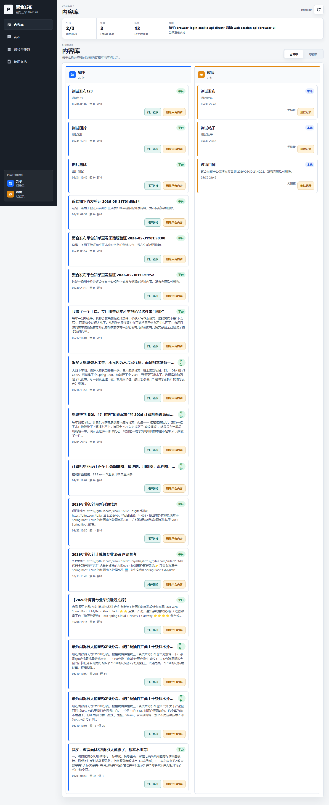

# 089 - 铁路订票平台 🔥最新

## 项目信息

- 项目编号：`089`
- 组件类型：`backend, frontend`
- 后端入口：`http://127.0.0.1:8089`
- 前端入口：`http://127.0.0.1:3000`
- 账号来源：未识别
- 已收录截图：`19` 张

## 默认账号

- 暂未自动识别到默认账号

## 预览截图

### guest

#### guest-01-dashboard

#### guest-01-login

#### guest-02-register

#### guest-02-user

#### guest-03-train

#### guest-04-station

#### guest-05-carriage

#### guest-06-schedule

#### guest-07-seat

#### guest-08-order

#### guest-09-my-order

#### guest-10-payment

#### guest-11-ticket

#### guest-12-my-ticket

#### guest-13-passenger

#### guest-14-after-sale

#### guest-15-notice

#### guest-16-profile

#### guest-17-statistics

