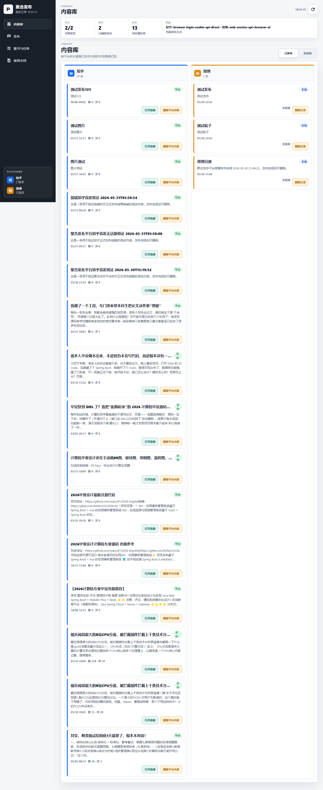
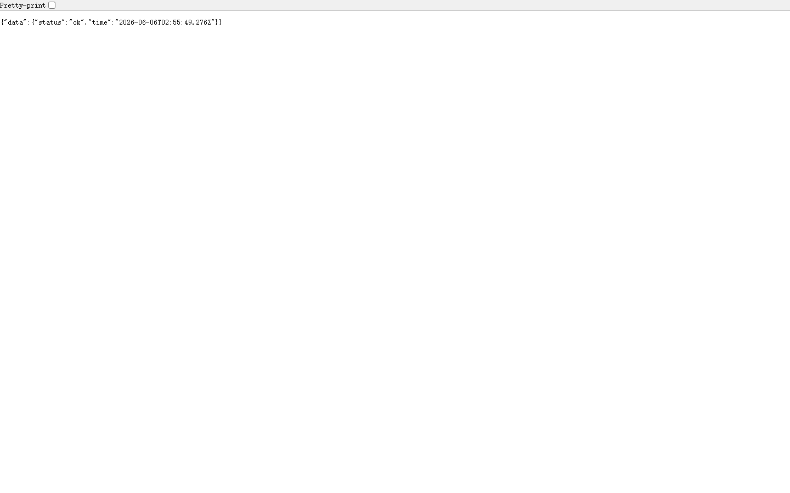

# 092 - 蓝天幼儿园管理系统

## 项目信息

- 项目编号：`092`
- 组件类型：`backend, frontend`
- 后端入口：`http://127.0.0.1:8092`
- 前端入口：`http://127.0.0.1:3000`
- 账号来源：未识别
- 已收录截图：`15` 张

## 默认账号

- 暂未自动识别到默认账号

## 预览截图

### guest

#### guest-01-dashboard

#### guest-01-login

#### guest-02-campus

#### guest-02-register

#### guest-03-grade

#### guest-04-classinfo

#### guest-05-term

#### guest-06-activity

#### guest-07-schedule

#### guest-08-child

#### guest-09-recipe

#### guest-10-attendance

#### guest-11-health

#### guest-12-feedback

#### guest-13-notice

