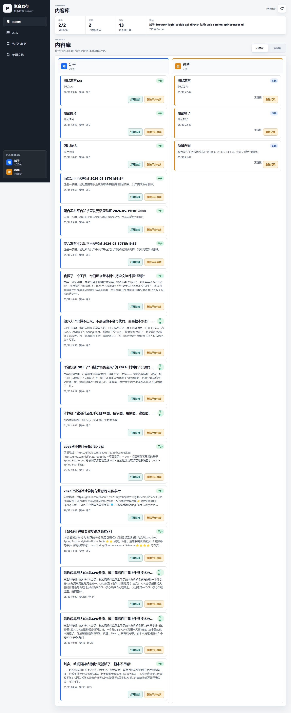

# 093 - 自助售货管理系统 🔥最新

## 项目信息

- 项目编号：`093`
- 组件类型：`backend, frontend`
- 后端入口：`http://127.0.0.1:8093`
- 前端入口：`http://127.0.0.1:3000`
- 账号来源：未识别
- 已收录截图：`17` 张

## 默认账号

- 暂未自动识别到默认账号

## 预览截图

### guest

#### guest-01-dashboard

#### guest-01-login

#### guest-02-register

#### guest-02-user

#### guest-03-location

#### guest-04-machine

#### guest-05-category

#### guest-06-product

#### guest-07-slot

#### guest-08-replenish

#### guest-09-order

#### guest-10-payment

#### guest-11-shipment

#### guest-12-fault

#### guest-13-notice

#### guest-14-statistics

#### guest-15-profile

