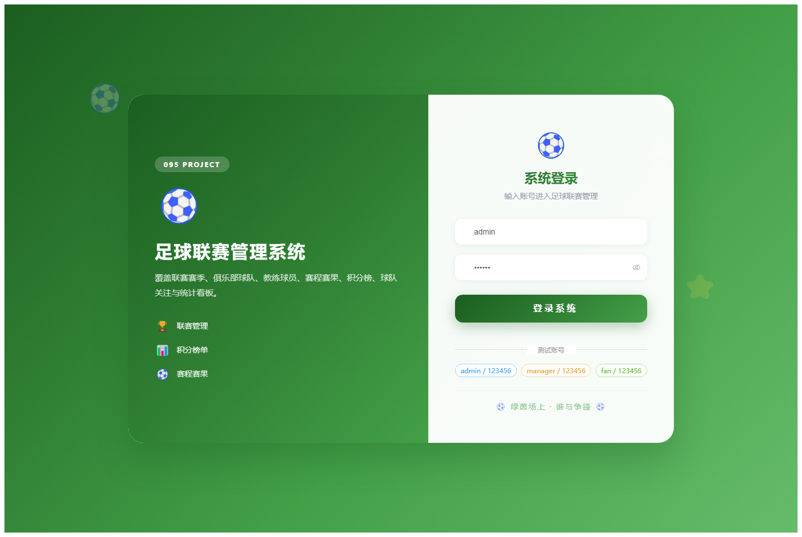

# 095 - 足球联赛管理系统

## 项目信息

- 项目编号：`095`
- 组件类型：`backend, frontend`
- 后端入口：`http://127.0.0.1:8095`
- 前端入口：`http://127.0.0.1:3095`
- 账号来源：未识别
- 已收录截图：`17` 张

## 默认账号

- 暂未自动识别到默认账号

## 预览截图

### guest

#### guest-01-dashboard

#### guest-01-login

#### guest-02-register

#### guest-02-user

#### guest-03-league

#### guest-04-season

#### guest-05-club

#### guest-06-team

#### guest-07-coach

#### guest-08-player

#### guest-09-venue

#### guest-10-match

#### guest-11-standing

#### guest-12-follow

#### guest-13-news

#### guest-14-statistics

#### guest-15-profile

