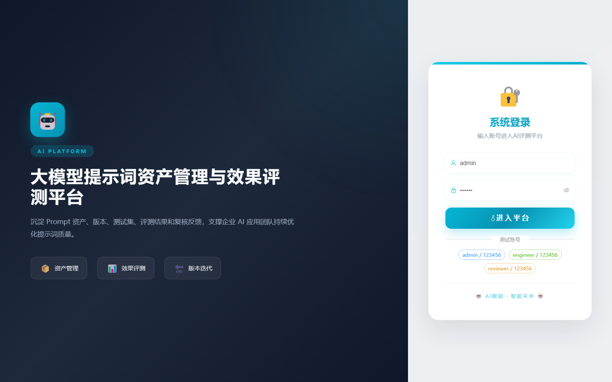

# 097 - 大模型提示词资产管理与效果评测平台

## 项目信息

- 项目编号：`097`
- 组件类型：`backend, frontend`
- 后端入口：`http://127.0.0.1:8097`
- 前端入口：`http://127.0.0.1:3097`
- 账号来源：未识别
- 已收录截图：`15` 张

## 默认账号

- 暂未自动识别到默认账号

## 预览截图

### guest

#### guest-01-dashboard

#### guest-01-login

#### guest-02-register

#### guest-02-user

#### guest-03-team

#### guest-04-category

#### guest-05-asset

#### guest-06-version

#### guest-07-case

#### guest-08-model

#### guest-09-rule

#### guest-10-evaluation

#### guest-11-result

#### guest-12-feedback

#### guest-13-log

