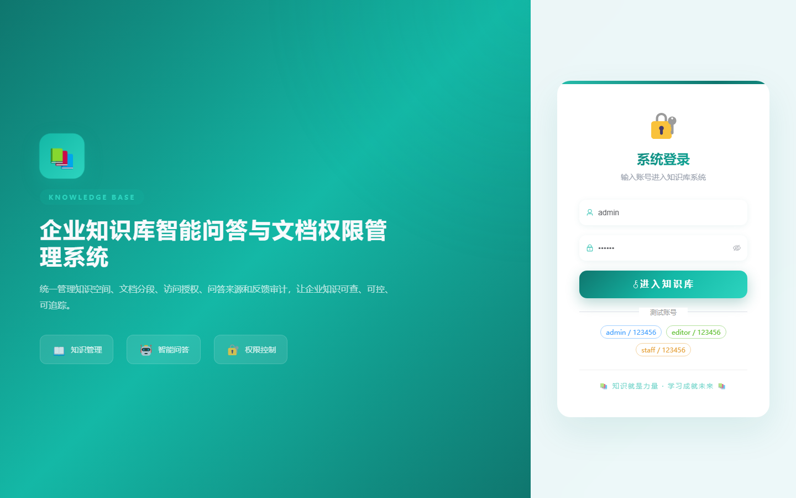

# 098 - 企业知识库智能问答与文档权限管理系统

## 项目信息

- 项目编号：`098`
- 组件类型：`backend, frontend`
- 后端入口：`http://127.0.0.1:8098`
- 前端入口：`http://127.0.0.1:3098`
- 账号来源：未识别
- 已收录截图：`15` 张

## 默认账号

- 暂未自动识别到默认账号

## 预览截图

### guest

#### guest-01-dashboard

#### guest-01-login

#### guest-02-register

#### guest-02-user

#### guest-03-space

#### guest-04-category

#### guest-05-document

#### guest-06-chunk

#### guest-07-group

#### guest-08-member

#### guest-09-permission

#### guest-10-session

#### guest-11-record

#### guest-12-feedback

#### guest-13-log

