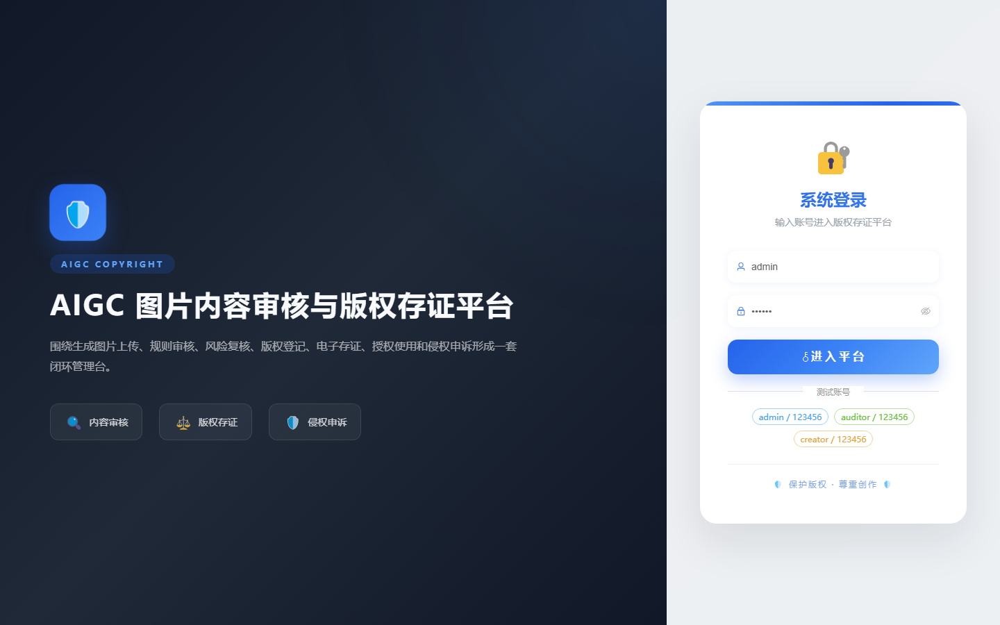
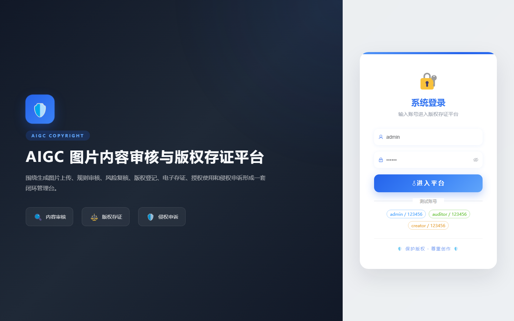

# 099 - AIGC 图片内容审核与版权存证平台

## 项目信息

- 项目编号：`099`
- 组件类型：`backend, frontend`
- 后端入口：`http://127.0.0.1:8099`
- 前端入口：`http://127.0.0.1:3099`
- 账号来源：未识别
- 已收录截图：`15` 张

## 默认账号

- 暂未自动识别到默认账号

## 预览截图

### guest

#### guest-01-dashboard

#### guest-01-login

#### guest-02-register

#### guest-02-user

#### guest-03-asset

#### guest-04-rule

#### guest-05-task

#### guest-06-result

#### guest-07-tag

#### guest-08-register

#### guest-09-evidence

#### guest-10-license

#### guest-11-clue

#### guest-12-appeal

#### guest-13-log

