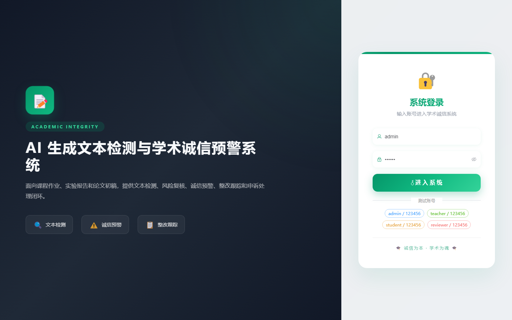
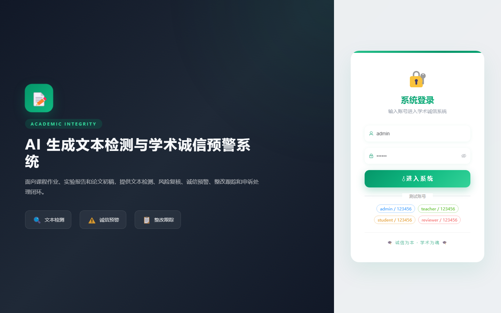

# 100 - AI 生成文本检测与学术诚信预警系统

## 项目信息

- 项目编号：`100`
- 组件类型：`backend, frontend`
- 后端入口：`http://127.0.0.1:8100`
- 前端入口：`http://127.0.0.1:3100`
- 账号来源：未识别
- 已收录截图：`16` 张

## 默认账号

- 暂未自动识别到默认账号

## 预览截图

### guest

#### guest-01-dashboard

#### guest-01-login

#### guest-02-register

#### guest-02-user

#### guest-03-course

#### guest-04-class

#### guest-05-student

#### guest-06-assignment

#### guest-07-submission

#### guest-08-rule

#### guest-09-task

#### guest-10-result

#### guest-11-warning

#### guest-12-rectification

#### guest-13-appeal

#### guest-14-log

