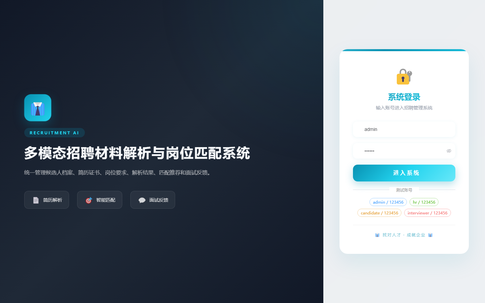

# 101 - 多模态招聘材料解析与岗位匹配系统

## 项目信息

- 项目编号：`101`
- 组件类型：`backend, frontend`
- 后端入口：`http://127.0.0.1:8101`
- 前端入口：`http://127.0.0.1:3101`
- 账号来源：未识别
- 已收录截图：`16` 张

## 默认账号

- 暂未自动识别到默认账号

## 预览截图

### guest

#### guest-01-dashboard

#### guest-01-login

#### guest-02-register

#### guest-02-user

#### guest-03-candidate

#### guest-04-resume

#### guest-05-certificate

#### guest-06-job

#### guest-07-requirement

#### guest-08-parse-task

#### guest-09-parse-result

#### guest-10-match-task

#### guest-11-match-result

#### guest-12-interview

#### guest-13-feedback

#### guest-14-log

