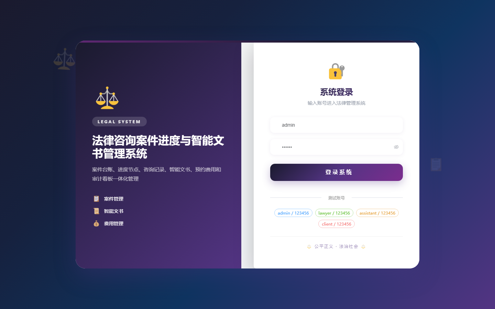

# 102 - 法律咨询案件进度与智能文书管理系统

## 项目信息

- 项目编号：`102`
- 组件类型：`backend, frontend`
- 后端入口：`http://127.0.0.1:8102`
- 前端入口：`http://127.0.0.1:3102`
- 账号来源：未识别
- 已收录截图：`16` 张

## 默认账号

- 暂未自动识别到默认账号

## 预览截图

### guest

#### guest-01-dashboard

#### guest-01-login

#### guest-02-register

#### guest-02-user

#### guest-03-client

#### guest-04-lawyer

#### guest-05-case

#### guest-06-stage

#### guest-07-consultation

#### guest-08-template

#### guest-09-document

#### guest-10-version

#### guest-11-appointment

#### guest-12-evidence

#### guest-13-fee

#### guest-14-log

