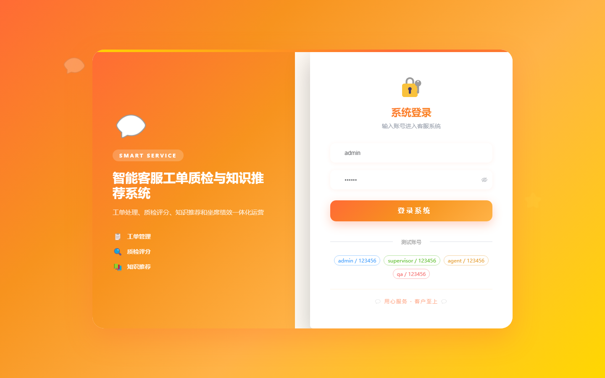

# 103 - 智能客服工单质检与知识推荐系统

## 项目信息

- 项目编号：`103`
- 组件类型：`backend, frontend`
- 后端入口：`http://127.0.0.1:8103`
- 前端入口：`http://127.0.0.1:3103`
- 账号来源：未识别
- 已收录截图：`17` 张

## 默认账号

- 暂未自动识别到默认账号

## 预览截图

### guest

#### guest-01-dashboard

#### guest-01-login

#### guest-02-register

#### guest-02-user

#### guest-03-customer

#### guest-04-channel

#### guest-05-category

#### guest-06-article

#### guest-07-order

#### guest-08-message

#### guest-09-assignment

#### guest-10-rule

#### guest-11-quality-task

#### guest-12-quality-result

#### guest-13-recommend

#### guest-14-performance

#### guest-15-log

