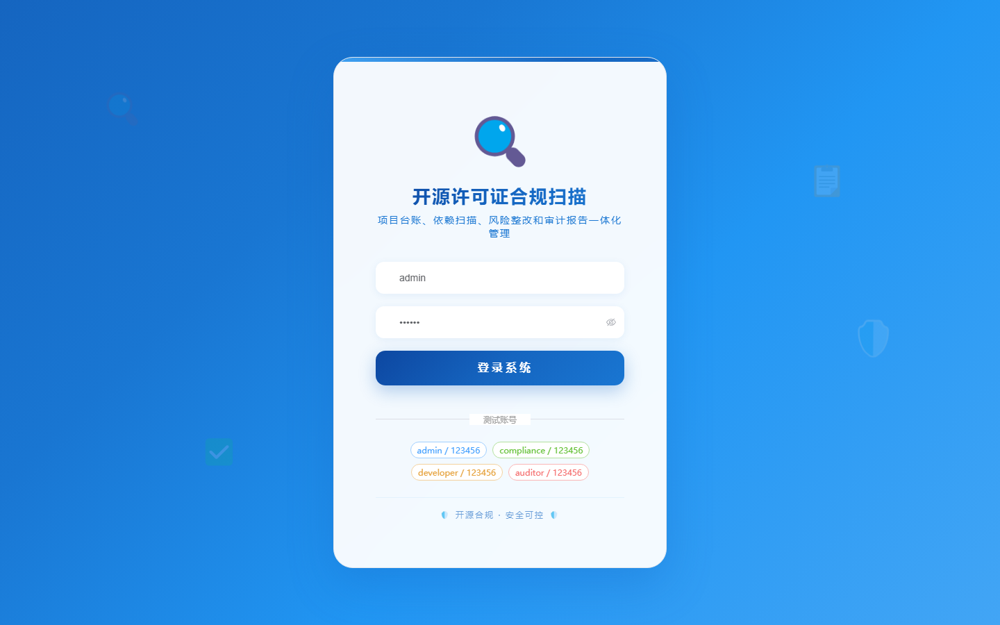
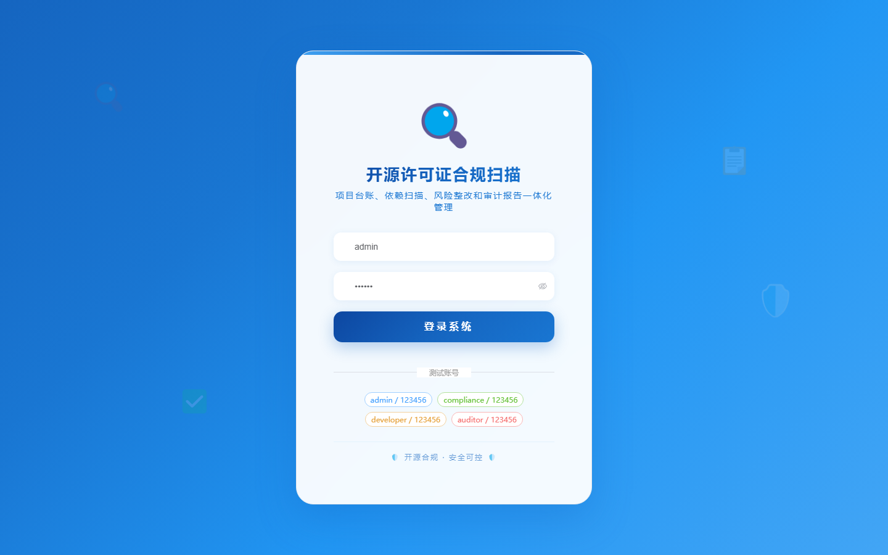

# 104 - 开源许可证合规扫描与项目台账系统

## 项目信息

- 项目编号：`104`
- 组件类型：`backend, frontend`
- 后端入口：`http://127.0.0.1:8104`
- 前端入口：`http://127.0.0.1:3104`
- 账号来源：未识别
- 已收录截图：`17` 张

## 默认账号

- 暂未自动识别到默认账号

## 预览截图

### guest

#### guest-01-dashboard

#### guest-01-login

#### guest-02-register

#### guest-02-user

#### guest-03-team

#### guest-04-repository

#### guest-05-branch

#### guest-06-dependency

#### guest-07-policy

#### guest-08-baseline

#### guest-09-scan-task

#### guest-10-scan-result

#### guest-11-issue

#### guest-12-rectification

#### guest-13-report

#### guest-14-approval

#### guest-15-log

