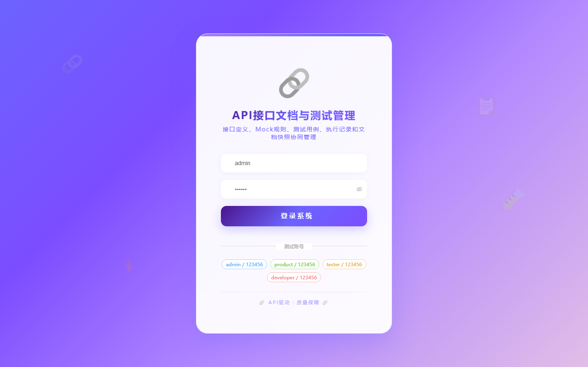

# 105 - API 接口文档生成与测试用例管理平台

## 项目信息

- 项目编号：`105`
- 组件类型：`backend, frontend`
- 后端入口：`http://127.0.0.1:8105`
- 前端入口：`http://127.0.0.1:3105`
- 账号来源：未识别
- 已收录截图：`17` 张

## 默认账号

- 暂未自动识别到默认账号

## 预览截图

### guest

#### guest-01-dashboard

#### guest-01-login

#### guest-02-register

#### guest-02-user

#### guest-03-project

#### guest-04-group

#### guest-05-endpoint

#### guest-06-request-param

#### guest-07-response-field

#### guest-08-mock-rule

#### guest-09-test-case

#### guest-10-test-step

#### guest-11-environment

#### guest-12-execution

#### guest-13-execution-result

#### guest-14-document

#### guest-15-log

