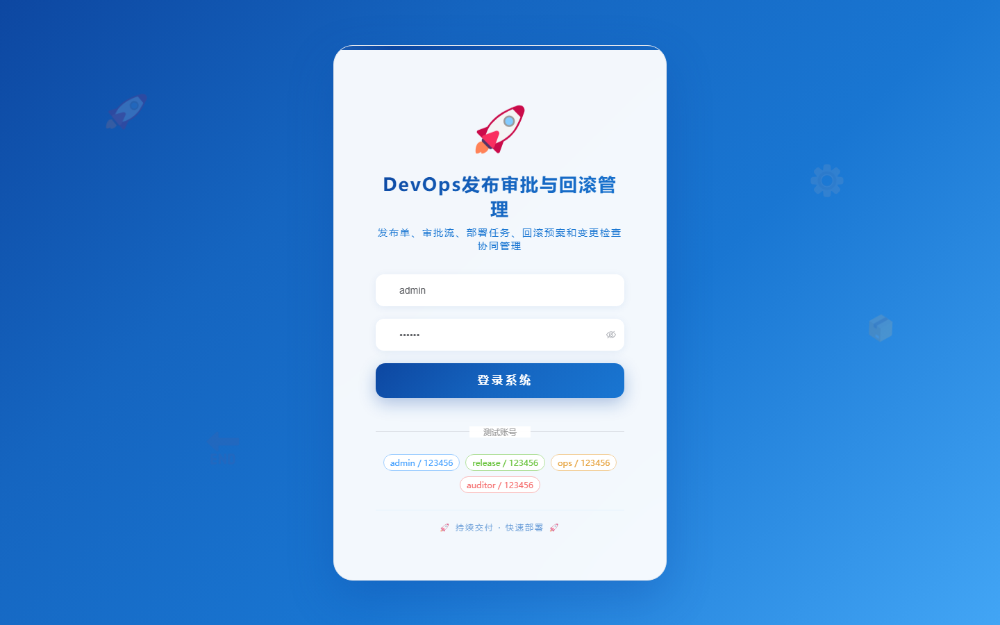
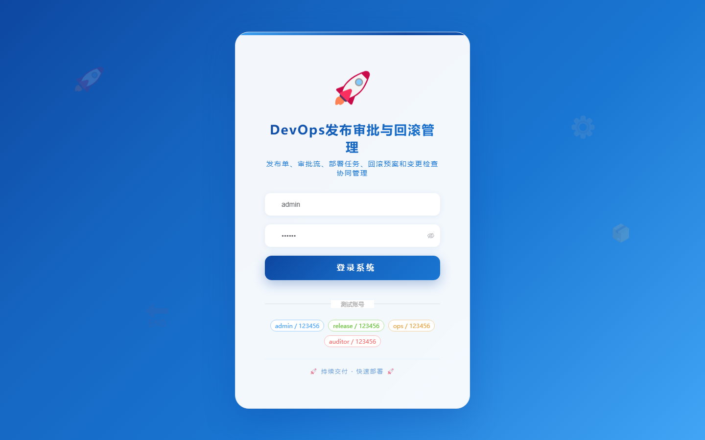

# 106 - DevOps 发布审批与回滚管理系统

## 项目信息

- 项目编号：`106`
- 组件类型：`backend, frontend`
- 后端入口：`http://127.0.0.1:8106`
- 前端入口：`http://127.0.0.1:3106`
- 账号来源：未识别
- 已收录截图：`17` 张

## 默认账号

- 暂未自动识别到默认账号

## 预览截图

### guest

#### guest-01-dashboard

#### guest-01-login

#### guest-02-register

#### guest-02-user

#### guest-03-environment

#### guest-04-service

#### guest-05-pipeline

#### guest-06-release-plan

#### guest-07-release-order

#### guest-08-approval-flow

#### guest-09-approval-record

#### guest-10-artifact

#### guest-11-deploy-task

#### guest-12-rollback-plan

#### guest-13-rollback-record

#### guest-14-checklist

#### guest-15-log

