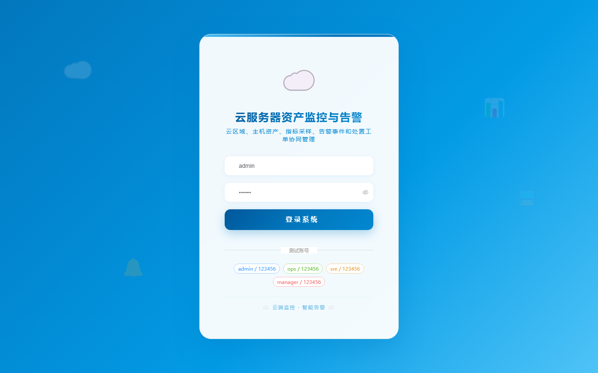

# 107 - 云服务器资产监控与告警平台

## 项目信息

- 项目编号：`107`
- 组件类型：`backend, frontend`
- 后端入口：`http://127.0.0.1:8107`
- 前端入口：`http://127.0.0.1:3107`
- 账号来源：未识别
- 已收录截图：`17` 张

## 默认账号

- 暂未自动识别到默认账号

## 预览截图

### guest

#### guest-01-dashboard

#### guest-01-login

#### guest-02-register

#### guest-02-user

#### guest-03-region

#### guest-04-asset

#### guest-05-group

#### guest-06-metric

#### guest-07-sample

#### guest-08-rule

#### guest-09-event

#### guest-10-notify

#### guest-11-ticket

#### guest-12-maintenance

#### guest-13-capacity

#### guest-14-widget

#### guest-15-log

