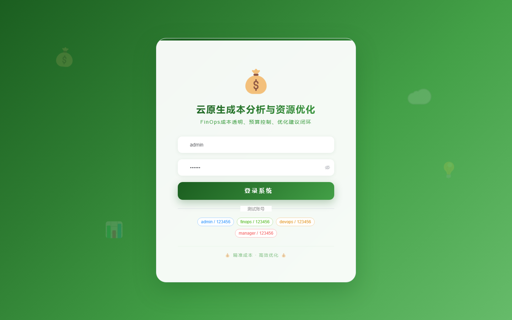
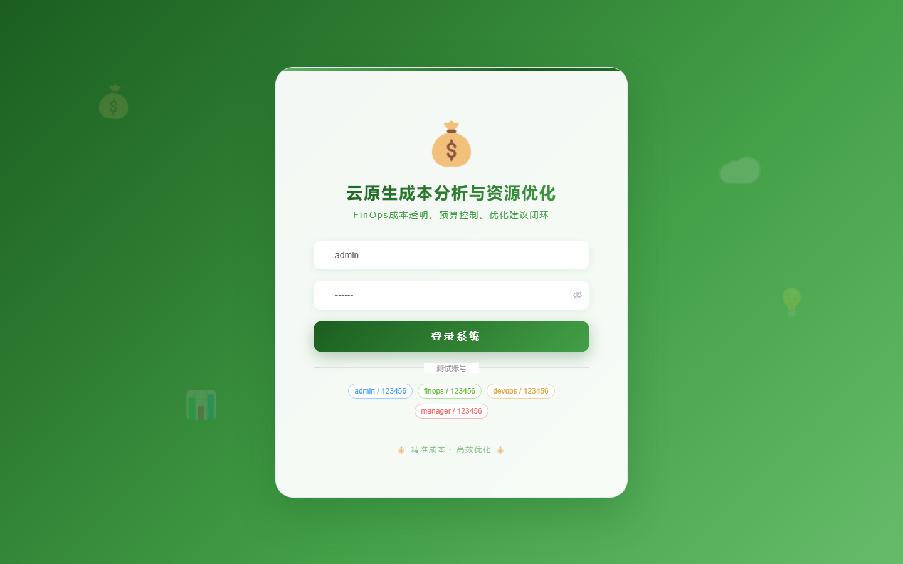

# 108 - 云原生成本分析与资源优化平台

## 项目信息

- 项目编号：`108`
- 组件类型：`backend, frontend`
- 后端入口：`http://127.0.0.1:8108`
- 前端入口：`http://127.0.0.1:3108`
- 账号来源：未识别
- 已收录截图：`17` 张

## 默认账号

- 暂未自动识别到默认账号

## 预览截图

### guest

#### guest-01-dashboard

#### guest-01-login

#### guest-02-register

#### guest-02-user

#### guest-03-account

#### guest-04-namespace

#### guest-05-bill

#### guest-06-cost-item

#### guest-07-budget

#### guest-08-allocation

#### guest-09-idle-resource

#### guest-10-optimization-rule

#### guest-11-advice

#### guest-12-saving-plan

#### guest-13-anomaly

#### guest-14-report

#### guest-15-log

