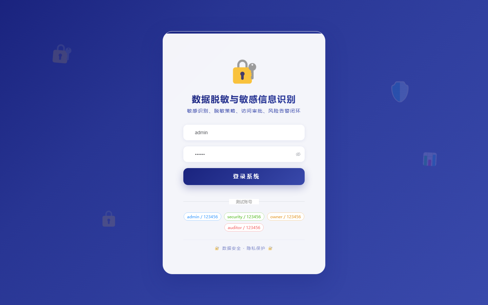
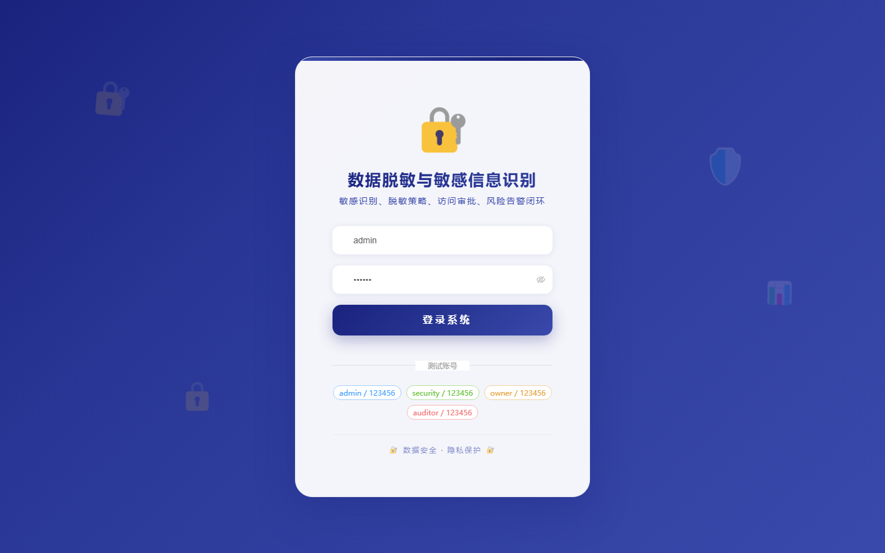

# 109 - 数据脱敏与敏感信息识别平台

## 项目信息

- 项目编号：`109`
- 组件类型：`backend, frontend`
- 后端入口：`http://127.0.0.1:8109`
- 前端入口：`http://127.0.0.1:3109`
- 账号来源：未识别
- 已收录截图：`17` 张

## 默认账号

- 暂未自动识别到默认账号

## 预览截图

### guest

#### guest-01-dashboard

#### guest-01-login

#### guest-02-register

#### guest-02-user

#### guest-03-source

#### guest-04-dataset

#### guest-05-rule

#### guest-06-recognition-task

#### guest-07-recognition-result

#### guest-08-strategy

#### guest-09-masking-task

#### guest-10-masking-record

#### guest-11-lineage

#### guest-12-access-request

#### guest-13-export-approval

#### guest-14-risk-alert

#### guest-15-log

