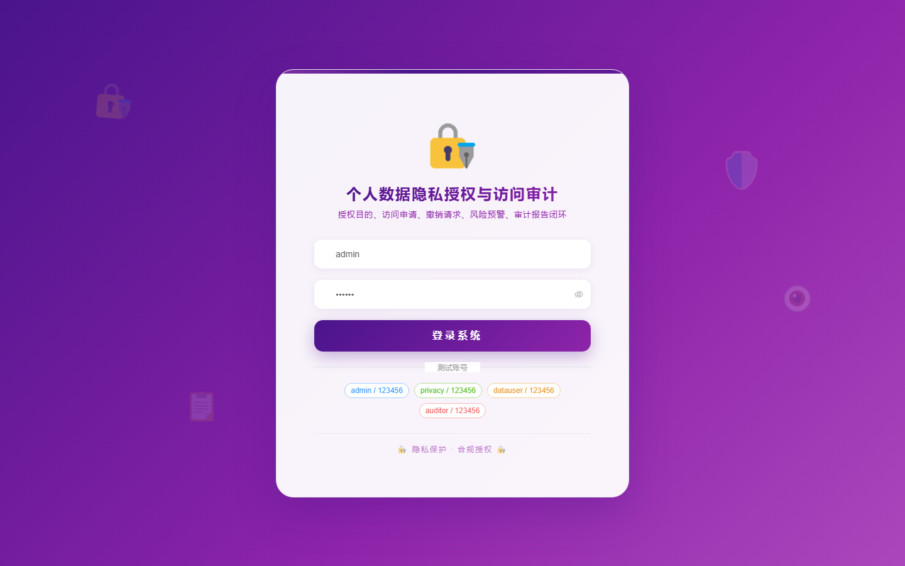
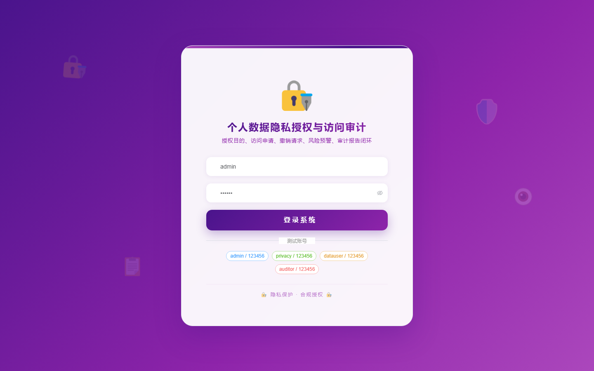

# 110 - 个人数据隐私授权与访问审计平台

## 项目信息

- 项目编号：`110`
- 组件类型：`backend, frontend`
- 后端入口：`http://127.0.0.1:8110`
- 前端入口：`http://127.0.0.1:3110`
- 账号来源：未识别
- 已收录截图：`17` 张

## 默认账号

- 暂未自动识别到默认账号

## 预览截图

### guest

#### guest-01-dashboard

#### guest-01-login

#### guest-02-register

#### guest-02-user

#### guest-03-subject

#### guest-04-data-item

#### guest-05-purpose

#### guest-06-policy

#### guest-07-authorization

#### guest-08-scope

#### guest-09-access-application

#### guest-10-grant

#### guest-11-access-log

#### guest-12-revocation

#### guest-13-risk-warning

#### guest-14-audit-report

#### guest-15-log

