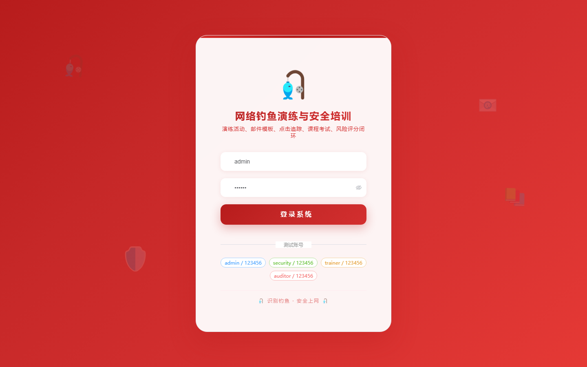
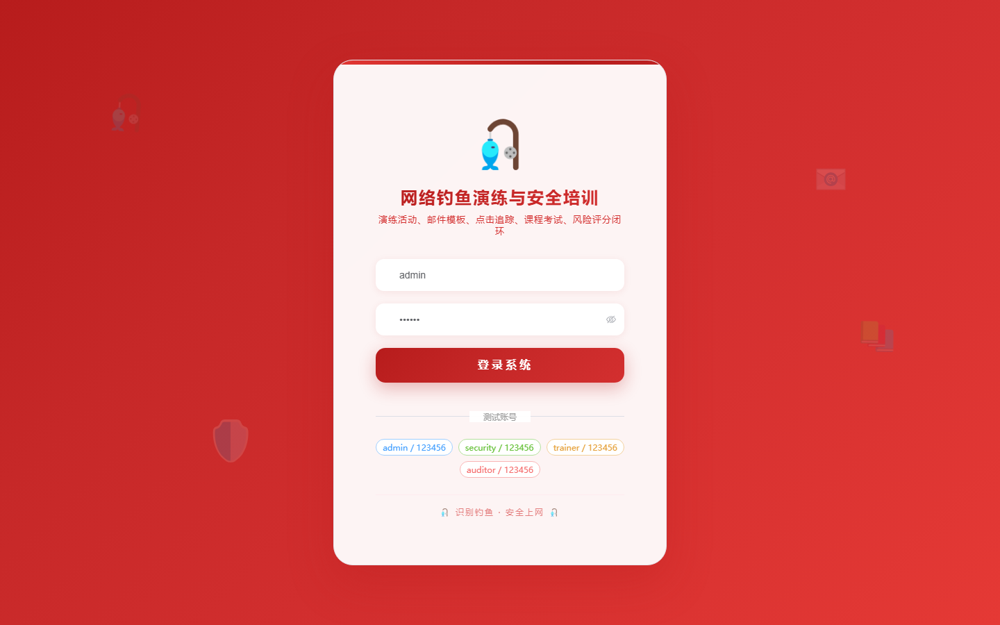

# 111 - 网络钓鱼邮件演练与安全意识培训平台

## 项目信息

- 项目编号：`111`
- 组件类型：`backend, frontend`
- 后端入口：`http://127.0.0.1:8111`
- 前端入口：`http://127.0.0.1:3111`
- 账号来源：未识别
- 已收录截图：`17` 张

## 默认账号

- 暂未自动识别到默认账号

## 预览截图

### guest

#### guest-01-dashboard

#### guest-01-login

#### guest-02-register

#### guest-02-user

#### guest-03-employee

#### guest-04-department

#### guest-05-template

#### guest-06-campaign

#### guest-07-target

#### guest-08-send-record

#### guest-09-click

#### guest-10-course

#### guest-11-exam

#### guest-12-question

#### guest-13-attempt

#### guest-14-risk-score

#### guest-15-log

