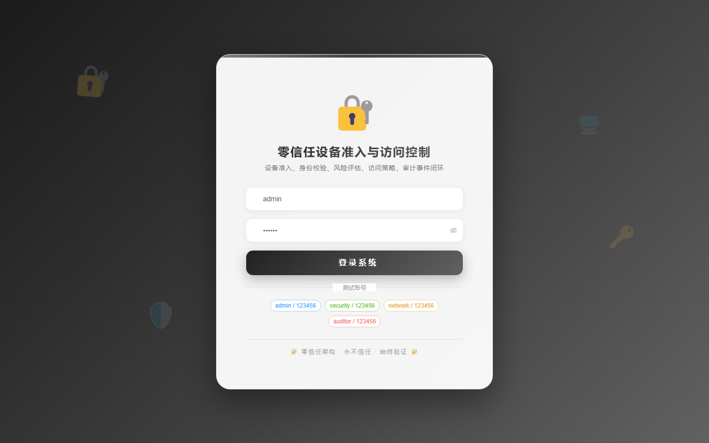
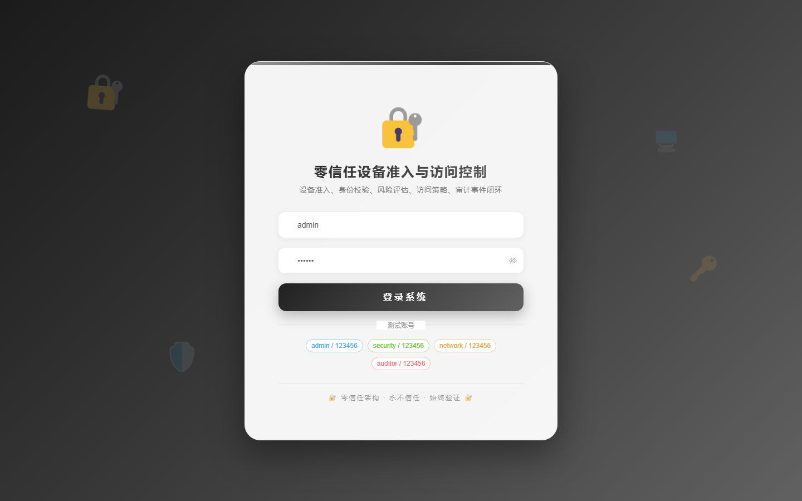

# 112 - 零信任设备准入与访问控制管理系统

## 项目信息

- 项目编号：`112`
- 组件类型：`backend, frontend`
- 后端入口：`http://127.0.0.1:8112`
- 前端入口：`http://127.0.0.1:3112`
- 账号来源：未识别
- 已收录截图：`17` 张

## 默认账号

- 暂未自动识别到默认账号

## 预览截图

### guest

#### guest-01-dashboard

#### guest-01-login

#### guest-02-register

#### guest-02-user

#### guest-03-device

#### guest-04-employee

#### guest-05-idp

#### guest-06-risk-model

#### guest-07-assessment

#### guest-08-policy

#### guest-09-rule

#### guest-10-application

#### guest-11-session

#### guest-12-segment

#### guest-13-certificate

#### guest-14-audit-event

#### guest-15-log

