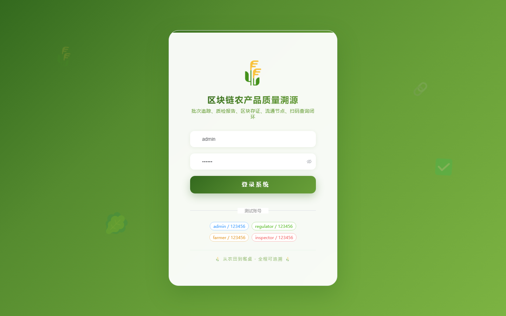
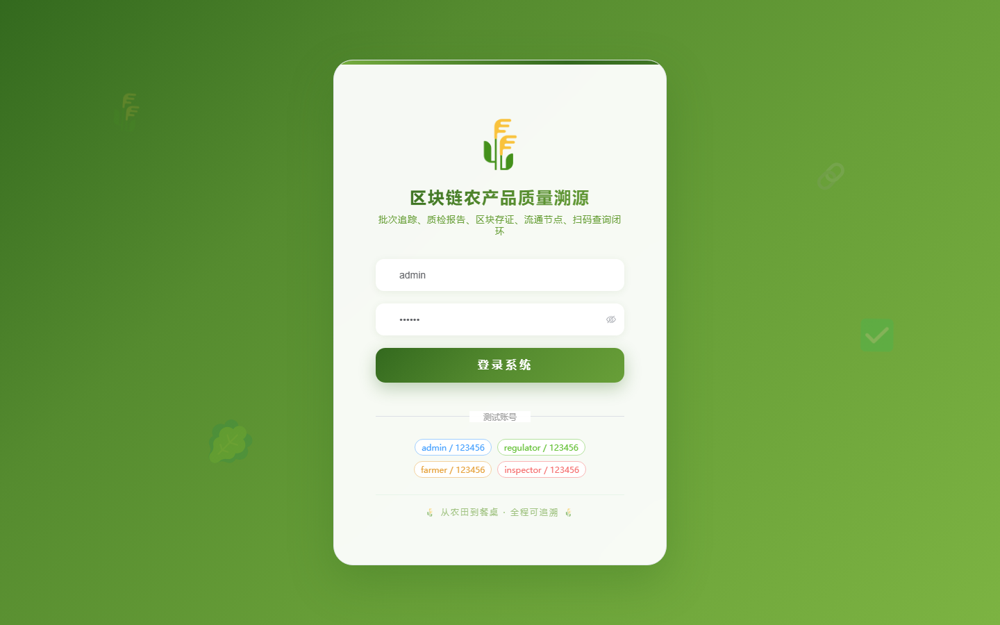
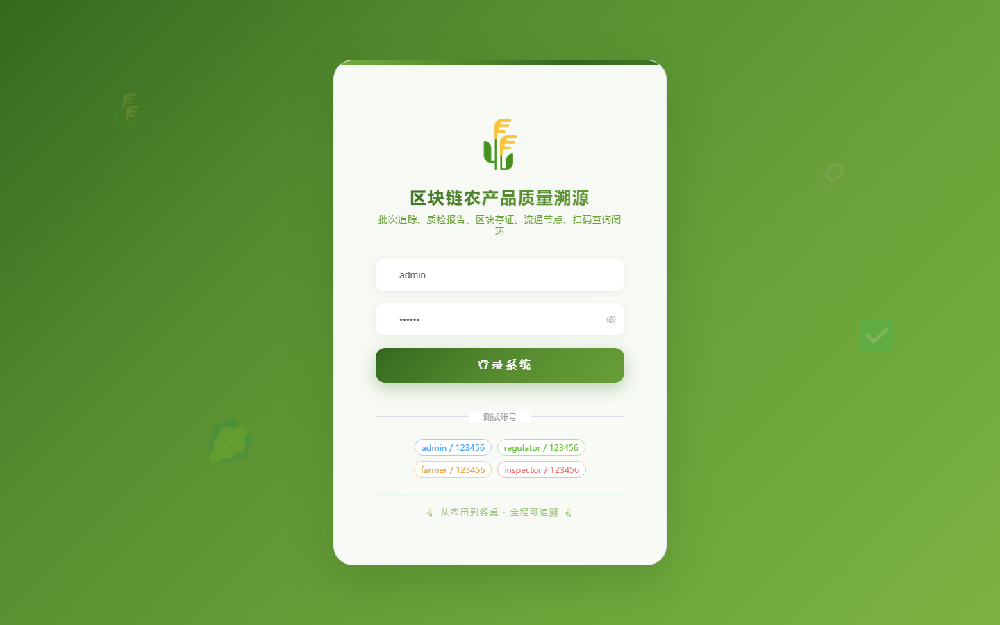

# 113 - 区块链农产品质量溯源与监管平台

## 项目信息

- 项目编号：`113`
- 组件类型：`backend, frontend`
- 后端入口：`http://127.0.0.1:8113`
- 前端入口：`http://127.0.0.1:3113`
- 账号来源：未识别
- 已收录截图：`17` 张

## 默认账号

- 暂未自动识别到默认账号

## 预览截图

### guest

#### guest-01-dashboard

#### guest-01-login

#### guest-02-register

#### guest-02-user

#### guest-03-farm

#### guest-04-farmer

#### guest-05-category

#### guest-06-batch

#### guest-07-planting

#### guest-08-material

#### guest-09-inspection

#### guest-10-block

#### guest-11-node

#### guest-12-logistics

#### guest-13-recall

#### guest-14-regulation

#### guest-15-log

