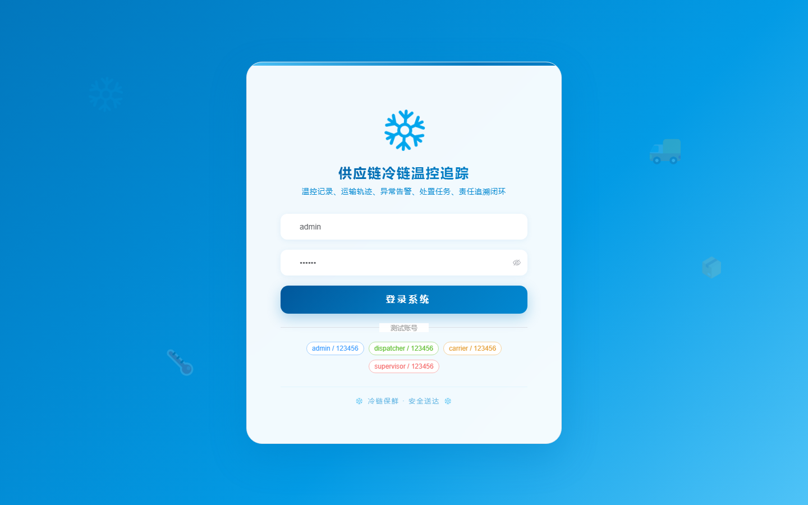

# 114 - 供应链冷链温控追踪与异常预警平台

## 项目信息

- 项目编号：`114`
- 组件类型：`backend, frontend`
- 后端入口：`http://127.0.0.1:8114`
- 前端入口：`http://127.0.0.1:3114`
- 账号来源：未识别
- 已收录截图：`17` 张

## 默认账号

- 暂未自动识别到默认账号

## 预览截图

### guest

#### guest-01-dashboard

#### guest-01-login

#### guest-02-register

#### guest-02-user

#### guest-03-warehouse

#### guest-04-carrier

#### guest-05-device

#### guest-06-cargo

#### guest-07-order

#### guest-08-temperature

#### guest-09-track

#### guest-10-rule

#### guest-11-alert

#### guest-12-task

#### guest-13-responsibility

#### guest-14-maintenance

#### guest-15-log

