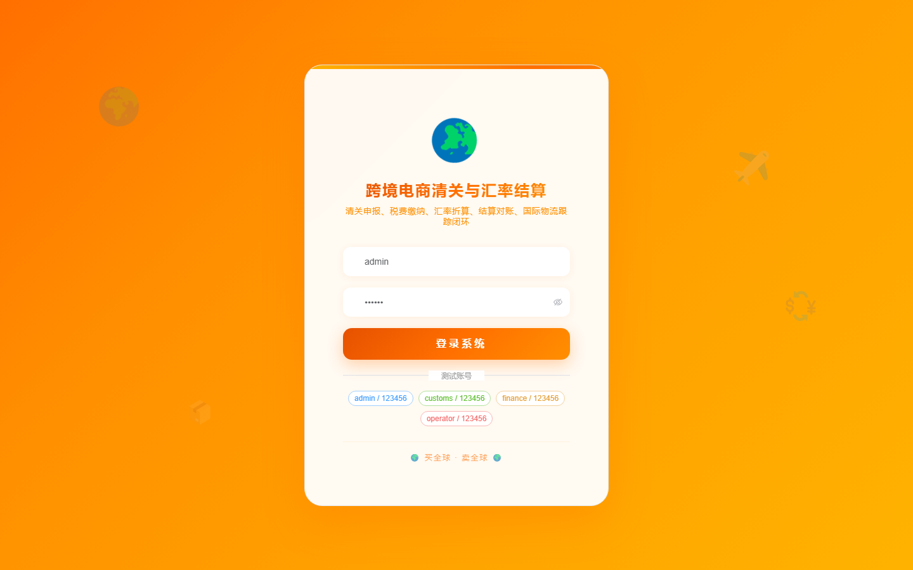
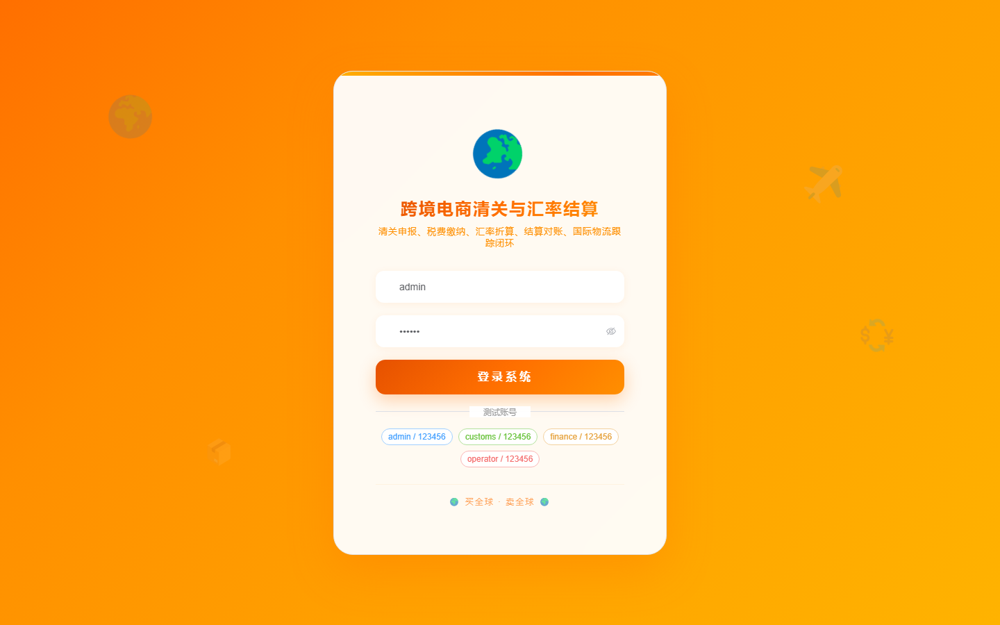

# 115 - 跨境电商清关订单与汇率结算平台

## 项目信息

- 项目编号：`115`
- 组件类型：`backend, frontend`
- 后端入口：`http://127.0.0.1:8115`
- 前端入口：`http://127.0.0.1:3115`
- 账号来源：未识别
- 已收录截图：`17` 张

## 默认账号

- 暂未自动识别到默认账号

## 预览截图

### guest

#### guest-01-dashboard

#### guest-01-login

#### guest-02-register

#### guest-02-user

#### guest-03-merchant

#### guest-04-customer

#### guest-05-sku

#### guest-06-order

#### guest-07-declaration

#### guest-08-document

#### guest-09-tax

#### guest-10-rate

#### guest-11-settlement

#### guest-12-payment

#### guest-13-logistics

#### guest-14-reconciliation

#### guest-15-log

