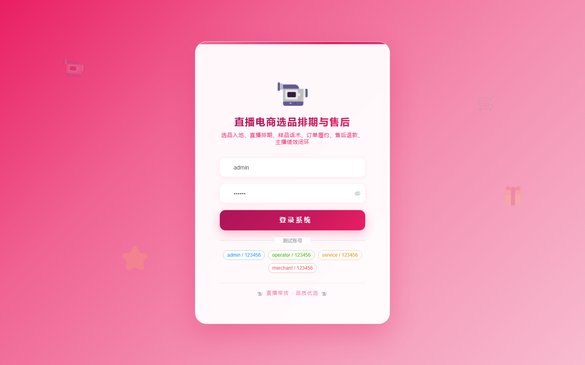

# 116 - 直播电商选品排期与售后工单系统

## 项目信息

- 项目编号：`116`
- 组件类型：`backend, frontend`
- 后端入口：`http://127.0.0.1:8116`
- 前端入口：`http://127.0.0.1:3116`
- 账号来源：未识别
- 已收录截图：`17` 张

## 默认账号

- 暂未自动识别到默认账号

## 预览截图

### guest

#### guest-01-dashboard

#### guest-01-login

#### guest-02-register

#### guest-02-user

#### guest-03-channel

#### guest-04-anchor

#### guest-05-supplier

#### guest-06-selection

#### guest-07-session

#### guest-08-schedule

#### guest-09-sample

#### guest-10-script

#### guest-11-order

#### guest-12-ticket

#### guest-13-refund

#### guest-14-performance

#### guest-15-log

