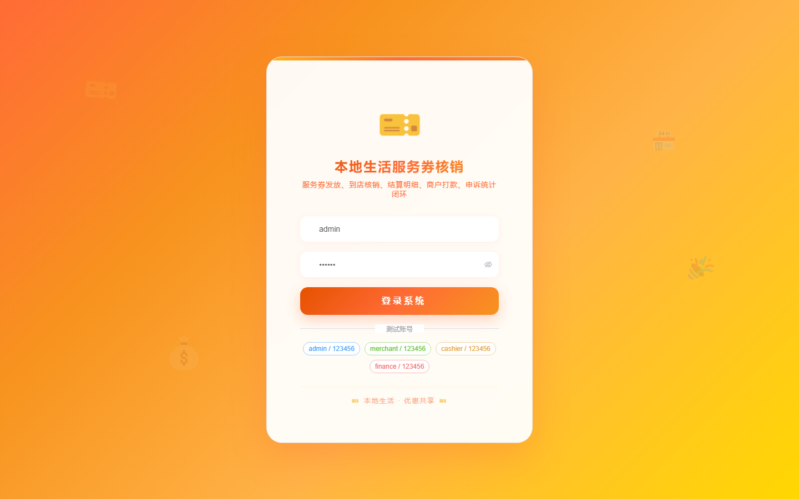
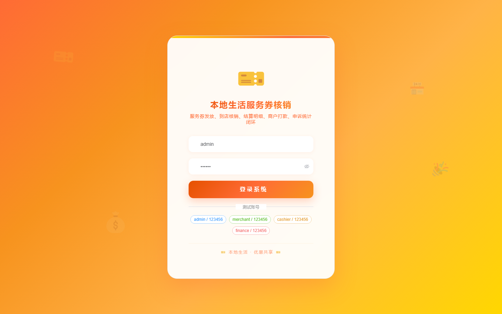

# 117 - 本地生活服务券核销与商户结算系统

## 项目信息

- 项目编号：`117`
- 组件类型：`backend, frontend`
- 后端入口：`http://127.0.0.1:8117`
- 前端入口：`http://127.0.0.1:3117`
- 账号来源：未识别
- 已收录截图：`17` 张

## 默认账号

- 暂未自动识别到默认账号

## 预览截图

### guest

#### guest-01-dashboard

#### guest-01-login

#### guest-02-register

#### guest-02-user

#### guest-03-merchant

#### guest-04-store

#### guest-05-consumer

#### guest-06-template

#### guest-07-activity

#### guest-08-coupon

#### guest-09-verification

#### guest-10-settlement

#### guest-11-detail

#### guest-12-transfer

#### guest-13-complaint

#### guest-14-stat-record

#### guest-15-log

