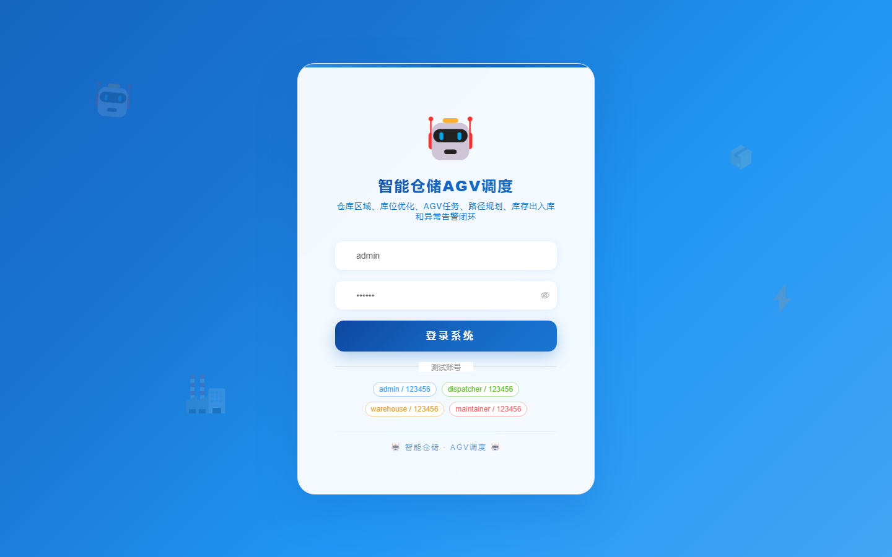
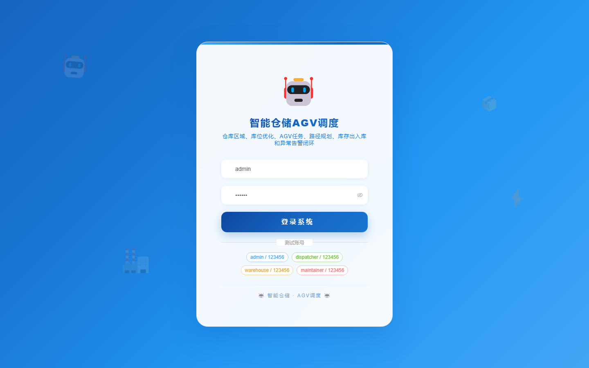

# 118 - 智能仓储 AGV 任务调度与库位优化系统

## 项目信息

- 项目编号：`118`
- 组件类型：`backend, frontend`
- 后端入口：`http://127.0.0.1:8118`
- 前端入口：`http://127.0.0.1:3118`
- 账号来源：未识别
- 已收录截图：`17` 张

## 默认账号

- 暂未自动识别到默认账号

## 预览截图

### guest

#### guest-01-dashboard

#### guest-01-login

#### guest-02-register

#### guest-02-user

#### guest-03-zone

#### guest-04-location

#### guest-05-agv

#### guest-06-station

#### guest-07-inventory

#### guest-08-inbound

#### guest-09-outbound

#### guest-10-task

#### guest-11-route

#### guest-12-recommendation

#### guest-13-maintenance

#### guest-14-alert

#### guest-15-log

