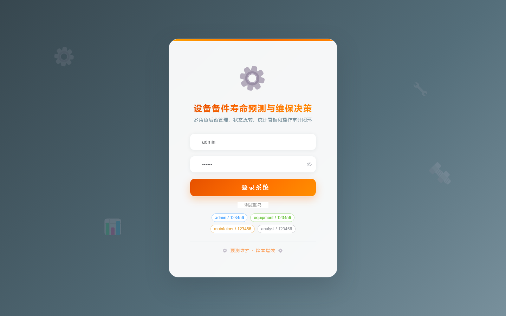
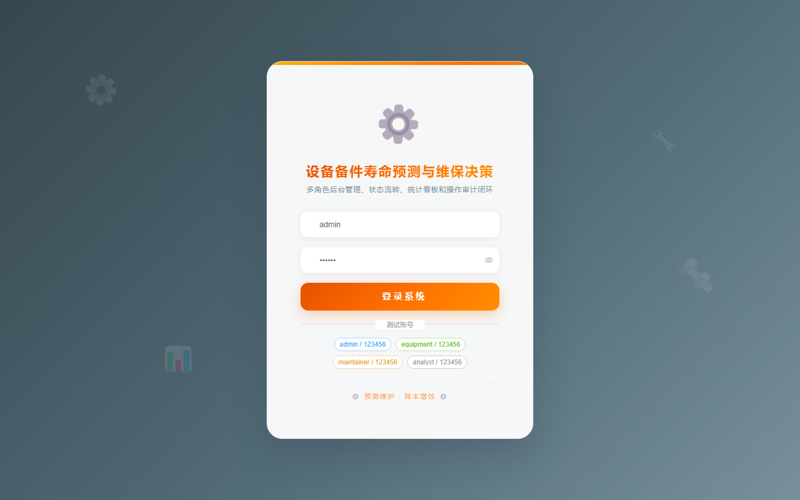

# 119 - 设备备件寿命预测与维保决策系统

## 项目信息

- 项目编号：`119`
- 组件类型：`backend, frontend`
- 后端入口：`http://127.0.0.1:8119`
- 前端入口：`http://127.0.0.1:3119`
- 账号来源：未识别
- 已收录截图：`17` 张

## 默认账号

- 暂未自动识别到默认账号

## 预览截图

### guest

#### guest-01-dashboard

#### guest-01-login

#### guest-02-register

#### guest-02-user

#### guest-03-asset

#### guest-04-catalog

#### guest-05-stock

#### guest-06-inbound

#### guest-07-outbound

#### guest-08-usage

#### guest-09-metric

#### guest-10-failure

#### guest-11-prediction

#### guest-12-plan

#### guest-13-purchase

#### guest-14-warning

#### guest-15-log

