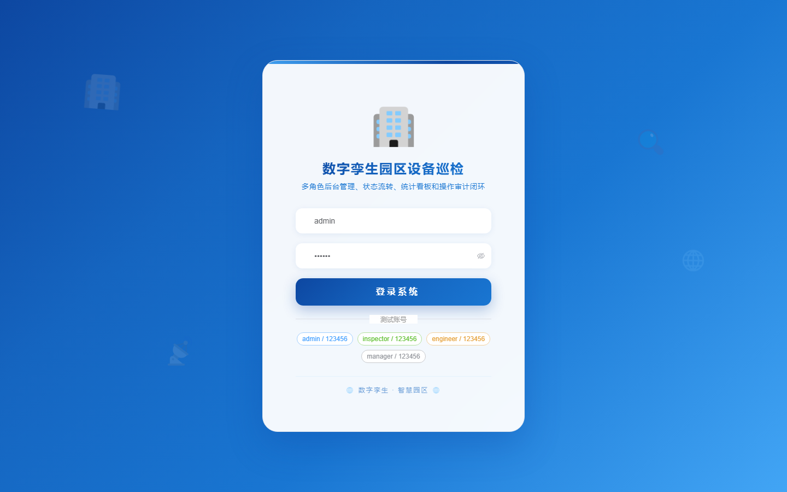

# 120 - 数字孪生园区设备巡检管理系统

## 项目信息

- 项目编号：`120`
- 组件类型：`backend, frontend`
- 后端入口：`http://127.0.0.1:8120`
- 前端入口：`http://127.0.0.1:3120`
- 账号来源：未识别
- 已收录截图：`17` 张

## 默认账号

- 暂未自动识别到默认账号

## 预览截图

### guest

#### guest-01-dashboard

#### guest-01-login

#### guest-02-register

#### guest-02-user

#### guest-03-building

#### guest-04-device

#### guest-05-route

#### guest-06-point

#### guest-07-task

#### guest-08-record

#### guest-09-defect

#### guest-10-work-order

#### guest-11-sensor

#### guest-12-model

#### guest-13-energy

#### guest-14-schedule

#### guest-15-log

