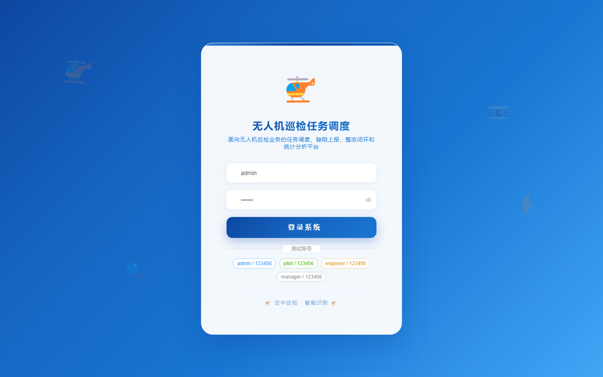
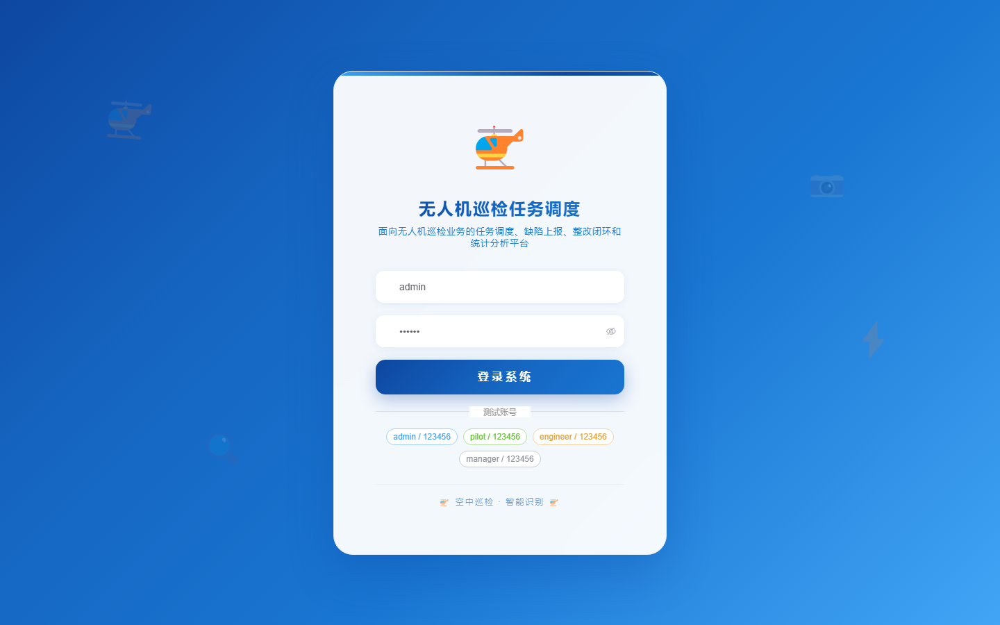

# 121 - 无人机巡检任务调度与缺陷上报平台

## 项目信息

- 项目编号：`121`
- 组件类型：`backend, frontend`
- 后端入口：`http://127.0.0.1:8121`
- 前端入口：`http://127.0.0.1:3121`
- 账号来源：未识别
- 已收录截图：`17` 张

## 默认账号

- 暂未自动识别到默认账号

## 预览截图

### guest

#### guest-01-dashboard

#### guest-01-login

#### guest-02-register

#### guest-02-user

#### guest-03-drone

#### guest-04-pilot

#### guest-05-zone

#### guest-06-route

#### guest-07-task

#### guest-08-flight

#### guest-09-defect

#### guest-10-image

#### guest-11-rectify

#### guest-12-station

#### guest-13-maintenance

#### guest-14-warning

#### guest-15-log

