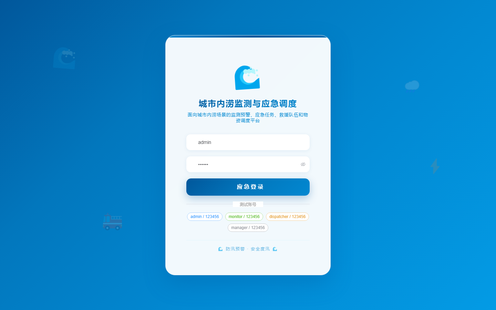
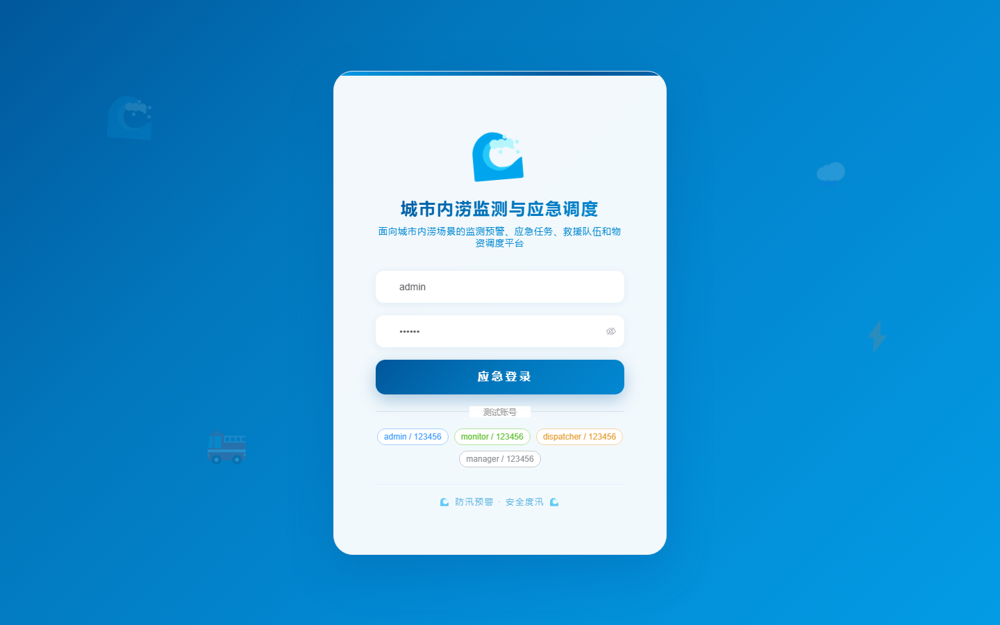

# 123 - 城市内涝监测与应急调度平台

## 项目信息

- 项目编号：`123`
- 组件类型：`backend, frontend`
- 后端入口：`http://127.0.0.1:8123`
- 前端入口：`http://127.0.0.1:3123`
- 账号来源：未识别
- 已收录截图：`17` 张

## 默认账号

- 暂未自动识别到默认账号

## 预览截图

### guest

#### guest-01-dashboard

#### guest-01-login

#### guest-02-register

#### guest-02-user

#### guest-03-point

#### guest-04-rainstation

#### guest-05-pump

#### guest-06-waterdata

#### guest-07-raindata

#### guest-08-rule

#### guest-09-warning

#### guest-10-plan

#### guest-11-task

#### guest-12-team

#### guest-13-material

#### guest-14-shelter

#### guest-15-log

