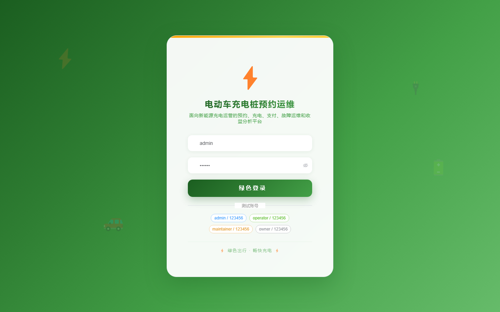

# 124 - 电动车充电桩预约与运维管理系统

## 项目信息

- 项目编号：`124`
- 组件类型：`backend, frontend`
- 后端入口：`http://127.0.0.1:8124`
- 前端入口：`http://127.0.0.1:3124`
- 账号来源：未识别
- 已收录截图：`17` 张

## 默认账号

- 暂未自动识别到默认账号

## 预览截图

### guest

#### guest-01-dashboard

#### guest-01-login

#### guest-02-register

#### guest-02-user

#### guest-03-station

#### guest-04-pile

#### guest-05-vehicle

#### guest-06-appointment

#### guest-07-session

#### guest-08-fault

#### guest-09-repair

#### guest-10-plan

#### guest-11-price

#### guest-12-payment

#### guest-13-revenue

#### guest-14-energy

#### guest-15-log

