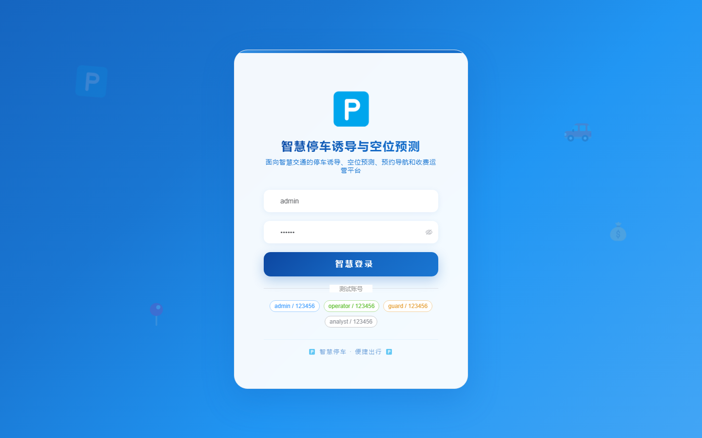
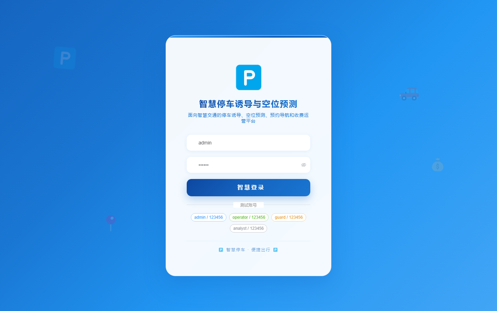

# 125 - 智慧停车诱导与空位预测平台

## 项目信息

- 项目编号：`125`
- 组件类型：`backend, frontend`
- 后端入口：`http://127.0.0.1:8125`
- 前端入口：`http://127.0.0.1:3125`
- 账号来源：未识别
- 已收录截图：`17` 张

## 默认账号

- 暂未自动识别到默认账号

## 预览截图

### guest

#### guest-01-dashboard

#### guest-01-login

#### guest-02-register

#### guest-02-user

#### guest-03-lot

#### guest-04-area

#### guest-05-space

#### guest-06-sensor

#### guest-07-vehicle

#### guest-08-reservation

#### guest-09-record

#### guest-10-payment

#### guest-11-prediction

#### guest-12-screen

#### guest-13-route

#### guest-14-fault

#### guest-15-log

