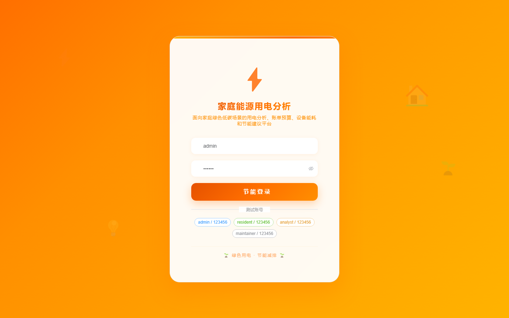

# 126 - 家庭能源用电分析与节能建议平台

## 项目信息

- 项目编号：`126`
- 组件类型：`backend, frontend`
- 后端入口：`http://127.0.0.1:8126`
- 前端入口：`http://127.0.0.1:3126`
- 账号来源：未识别
- 已收录截图：`17` 张

## 默认账号

- 暂未自动识别到默认账号

## 预览截图

### guest

#### guest-01-dashboard

#### guest-01-login

#### guest-02-register

#### guest-02-user

#### guest-03-home

#### guest-04-member

#### guest-05-meter

#### guest-06-device

#### guest-07-reading

#### guest-08-bill

#### guest-09-usage

#### guest-10-budget

#### guest-11-suggestion

#### guest-12-alert

#### guest-13-carbon

#### guest-14-ticket

#### guest-15-log

