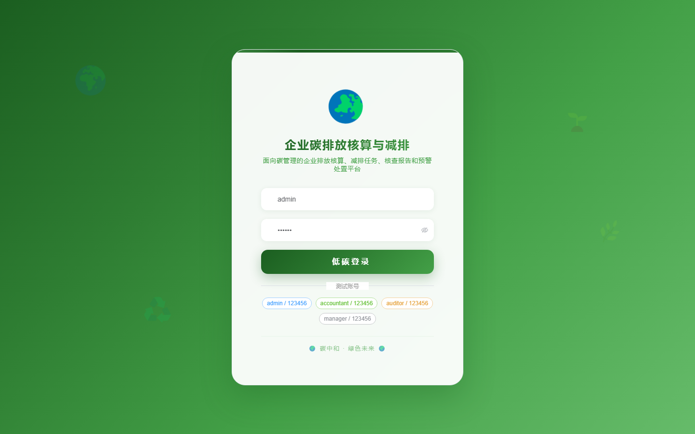
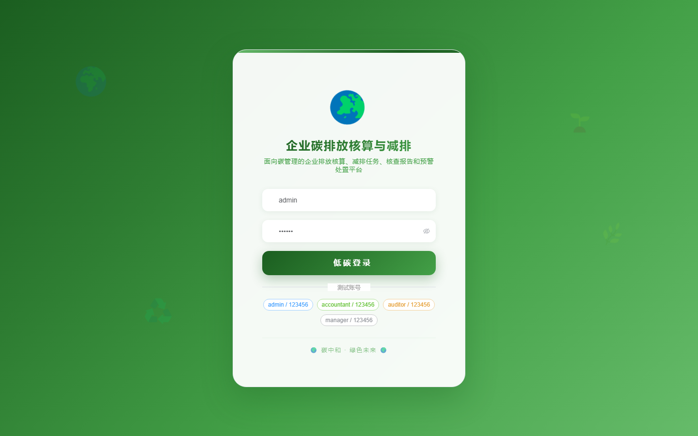

# 127 - 企业碳排放核算与减排任务管理系统

## 项目信息

- 项目编号：`127`
- 组件类型：`backend, frontend`
- 后端入口：`http://127.0.0.1:8127`
- 前端入口：`http://127.0.0.1:3127`
- 账号来源：未识别
- 已收录截图：`17` 张

## 默认账号

- 暂未自动识别到默认账号

## 预览截图

### guest

#### guest-01-dashboard

#### guest-01-login

#### guest-02-register

#### guest-02-user

#### guest-03-company

#### guest-04-factor

#### guest-05-period

#### guest-06-consumption

#### guest-07-emission

#### guest-08-task

#### guest-09-measure

#### guest-10-quota

#### guest-11-report

#### guest-12-attachment

#### guest-13-rule

#### guest-14-warning

#### guest-15-log

