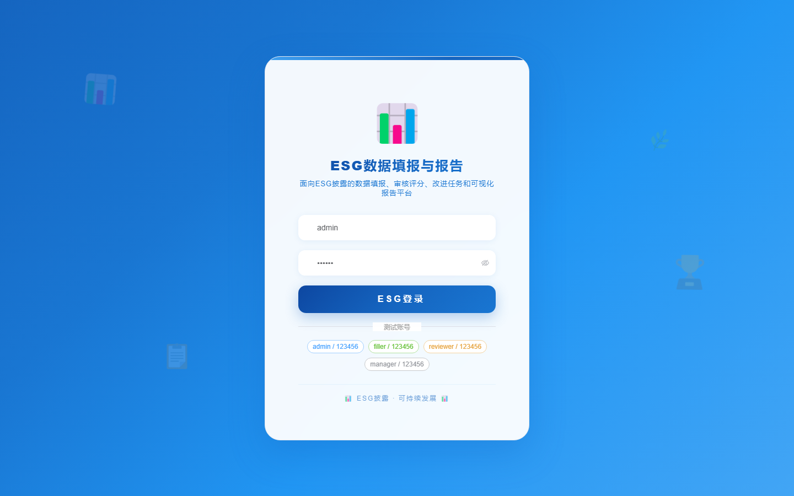

# 128 - ESG 数据填报与可视化报告系统

## 项目信息

- 项目编号：`128`
- 组件类型：`backend, frontend`
- 后端入口：`http://127.0.0.1:8128`
- 前端入口：`http://127.0.0.1:3128`
- 账号来源：未识别
- 已收录截图：`17` 张

## 默认账号

- 暂未自动识别到默认账号

## 预览截图

### guest

#### guest-01-dashboard

#### guest-01-login

#### guest-02-register

#### guest-02-user

#### guest-03-indicator

#### guest-04-template

#### guest-05-period

#### guest-06-submission

#### guest-07-data

#### guest-08-evidence

#### guest-09-review

#### guest-10-model

#### guest-11-score

#### guest-12-improvement

#### guest-13-feedback

#### guest-14-export

#### guest-15-log

