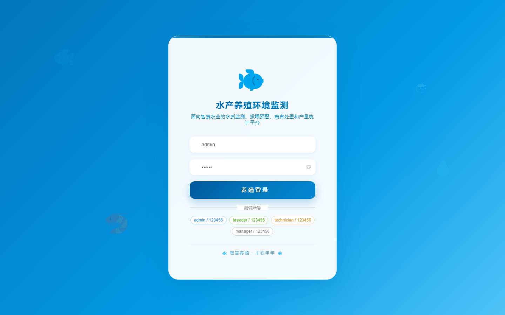
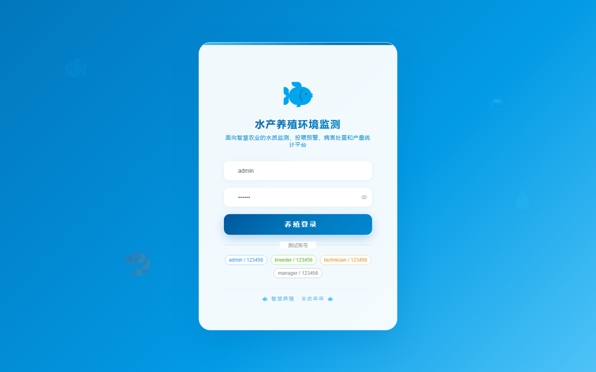

# 129 - 水产养殖环境监测与投喂预警系统

## 项目信息

- 项目编号：`129`
- 组件类型：`backend, frontend`
- 后端入口：`http://127.0.0.1:8129`
- 前端入口：`http://127.0.0.1:3129`
- 账号来源：未识别
- 已收录截图：`17` 张

## 默认账号

- 暂未自动识别到默认账号

## 预览截图

### guest

#### guest-01-dashboard

#### guest-01-login

#### guest-02-register

#### guest-02-user

#### guest-03-pond

#### guest-04-sensor

#### guest-05-reading

#### guest-06-plan

#### guest-07-feeding

#### guest-08-batch

#### guest-09-sampling

#### guest-10-disease

#### guest-11-medication

#### guest-12-equipment

#### guest-13-rule

#### guest-14-statistic

#### guest-15-log

