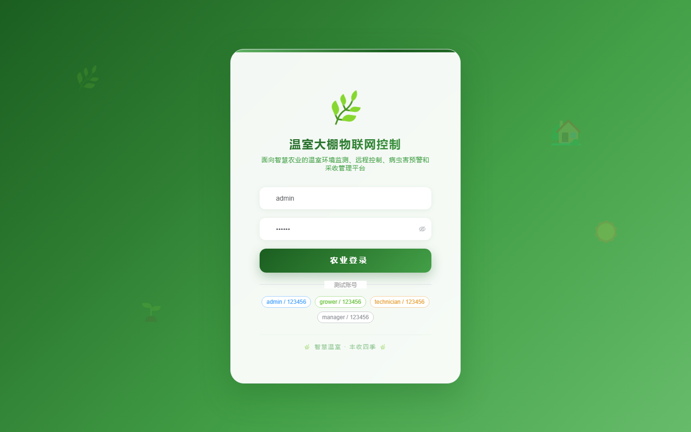
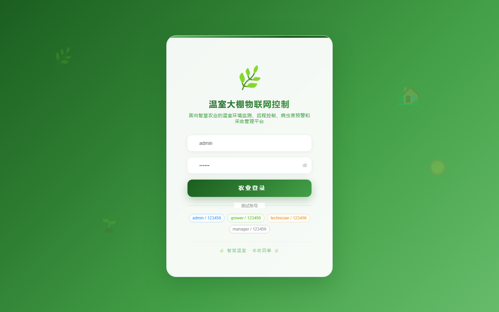

# 130 - 温室大棚物联网控制与病害预警系统

## 项目信息

- 项目编号：`130`
- 组件类型：`backend, frontend`
- 后端入口：`http://127.0.0.1:8130`
- 前端入口：`http://127.0.0.1:3130`
- 账号来源：未识别
- 已收录截图：`17` 张

## 默认账号

- 暂未自动识别到默认账号

## 预览截图

### guest

#### guest-01-dashboard

#### guest-01-login

#### guest-02-register

#### guest-02-user

#### guest-03-greenhouse

#### guest-04-crop

#### guest-05-sensor

#### guest-06-reading

#### guest-07-irrigation

#### guest-08-fertilizer

#### guest-09-pest

#### guest-10-diagnosis

#### guest-11-device

#### guest-12-command

#### guest-13-harvest

#### guest-14-ticket

#### guest-15-log

