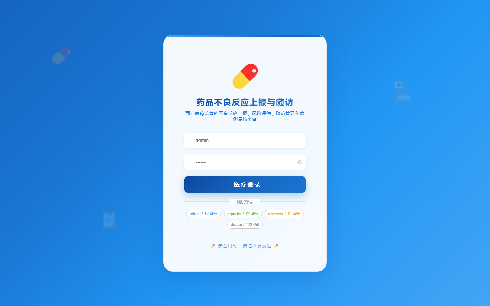
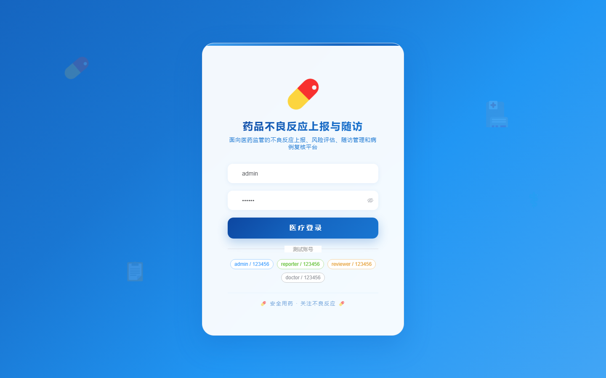

# 131 - 药品不良反应上报与随访管理系统

## 项目信息

- 项目编号：`131`
- 组件类型：`backend, frontend`
- 后端入口：`http://127.0.0.1:8131`
- 前端入口：`http://127.0.0.1:3131`
- 账号来源：未识别
- 已收录截图：`17` 张

## 默认账号

- 暂未自动识别到默认账号

## 预览截图

### guest

#### guest-01-dashboard

#### guest-01-login

#### guest-02-register

#### guest-02-user

#### guest-03-patient

#### guest-04-drug

#### guest-05-reporter

#### guest-06-report

#### guest-07-symptom

#### guest-08-risk

#### guest-09-plan

#### guest-10-followup

#### guest-11-review

#### guest-12-advice

#### guest-13-department

#### guest-14-statistic

#### guest-15-log

