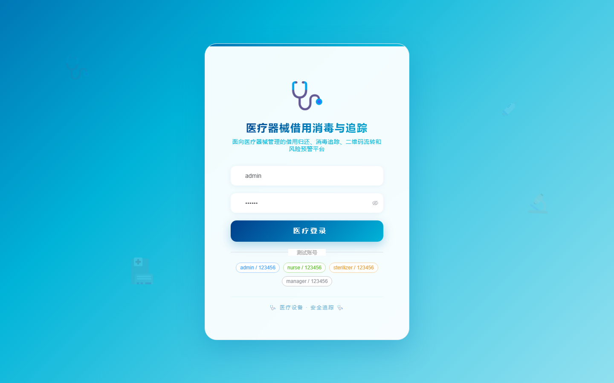
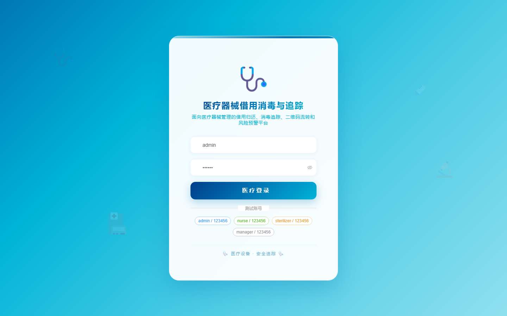

# 132 - 医疗器械借用消毒与追踪管理系统

## 项目信息

- 项目编号：`132`
- 组件类型：`backend, frontend`
- 后端入口：`http://127.0.0.1:8132`
- 前端入口：`http://127.0.0.1:3132`
- 账号来源：未识别
- 已收录截图：`17` 张

## 默认账号

- 暂未自动识别到默认账号

## 预览截图

### guest

#### guest-01-dashboard

#### guest-01-login

#### guest-02-register

#### guest-02-user

#### guest-03-device

#### guest-04-category

#### guest-05-department

#### guest-06-request

#### guest-07-borrow

#### guest-08-return

#### guest-09-batch

#### guest-10-sterilization

#### guest-11-trace

#### guest-12-maintenance

#### guest-13-inspection

#### guest-14-alert

#### guest-15-log

