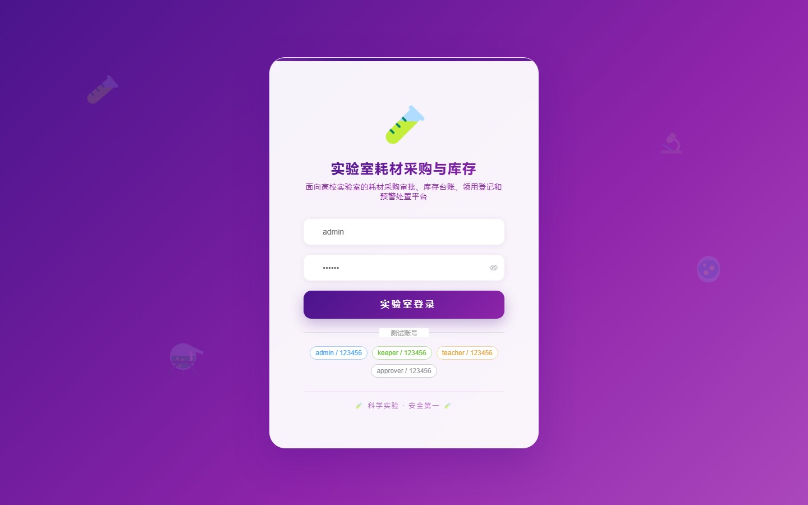
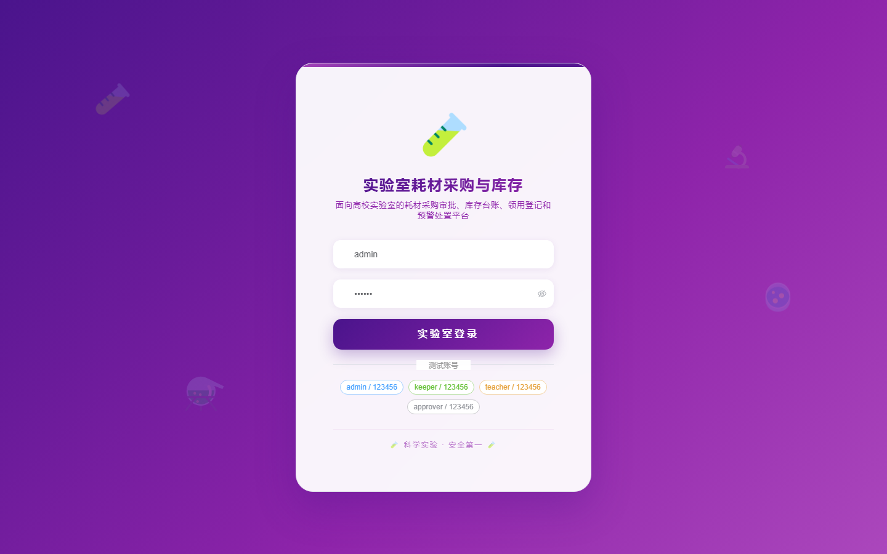

# 133 - 实验室耗材采购审批与库存预警系统

## 项目信息

- 项目编号：`133`
- 组件类型：`backend, frontend`
- 后端入口：`http://127.0.0.1:8133`
- 前端入口：`http://127.0.0.1:3133`
- 账号来源：未识别
- 已收录截图：`17` 张

## 默认账号

- 暂未自动识别到默认账号

## 预览截图

### guest

#### guest-01-dashboard

#### guest-01-login

#### guest-02-register

#### guest-02-user

#### guest-03-catalog

#### guest-04-supplier

#### guest-05-lab

#### guest-06-stock

#### guest-07-request

#### guest-08-approval

#### guest-09-order

#### guest-10-inbound

#### guest-11-outbound

#### guest-12-check

#### guest-13-rule

#### guest-14-warning

#### guest-15-log

