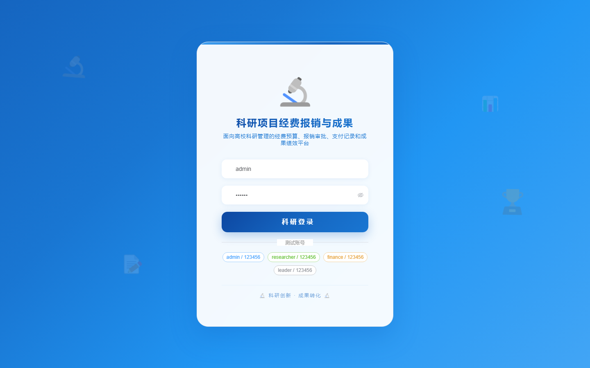

# 134 - 科研项目经费报销与成果管理系统

## 项目信息

- 项目编号：`134`
- 组件类型：`backend, frontend`
- 后端入口：`http://127.0.0.1:8134`
- 前端入口：`http://127.0.0.1:3134`
- 账号来源：未识别
- 已收录截图：`17` 张

## 默认账号

- 暂未自动识别到默认账号

## 预览截图

### guest

#### guest-01-dashboard

#### guest-01-login

#### guest-02-register

#### guest-02-user

#### guest-03-project

#### guest-04-category

#### guest-05-budget

#### guest-06-claim

#### guest-07-invoice

#### guest-08-approval

#### guest-09-payment

#### guest-10-achievement

#### guest-11-paper

#### guest-12-patent

#### guest-13-statistic

#### guest-14-risk

#### guest-15-log

