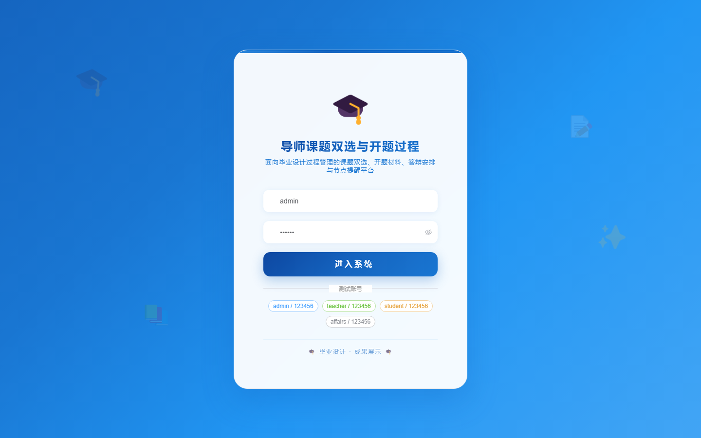
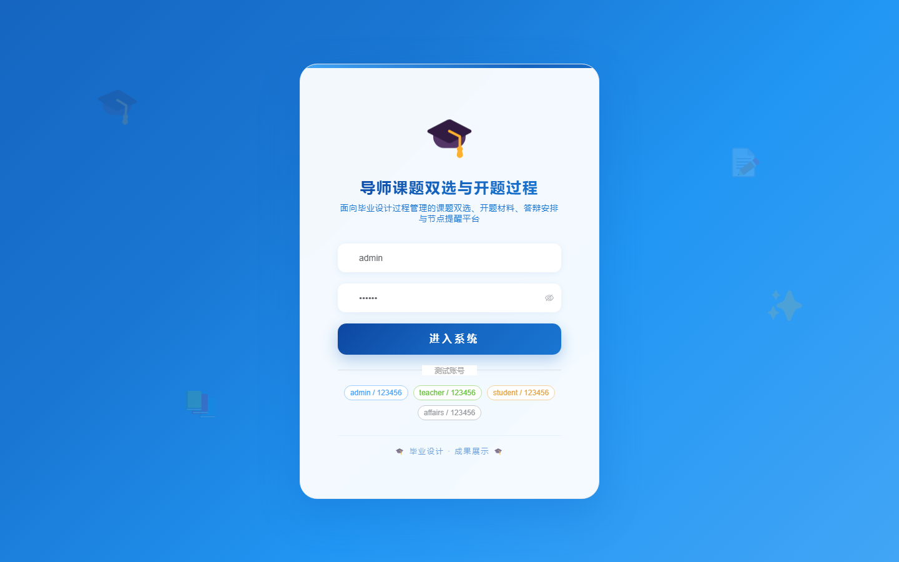
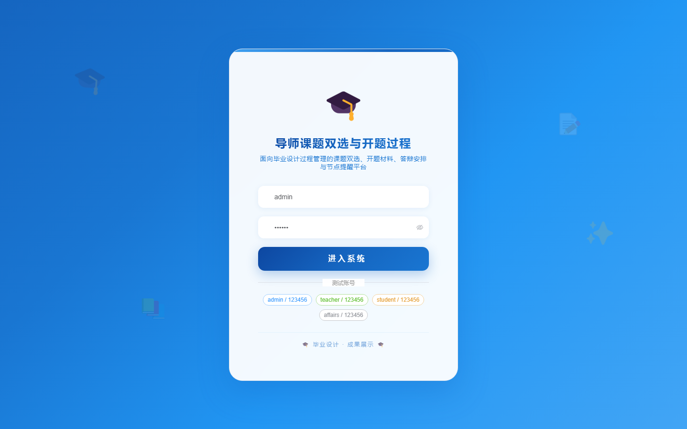
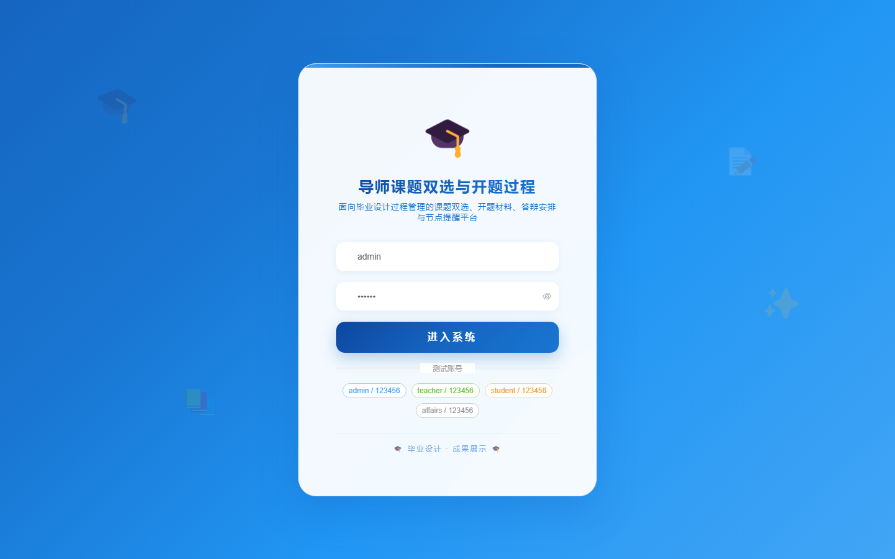

# 136 - 导师课题双选与开题过程管理系统

## 项目信息

- 项目编号：`136`
- 组件类型：`backend, frontend`
- 后端入口：`http://127.0.0.1:8136`
- 前端入口：`http://127.0.0.1:3136`
- 账号来源：未识别
- 已收录截图：`17` 张

## 默认账号

- 暂未自动识别到默认账号

## 预览截图

### guest

#### guest-01-dashboard

#### guest-01-login

#### guest-02-register

#### guest-02-user

#### guest-03-topic

#### guest-04-teacher

#### guest-05-student

#### guest-06-application

#### guest-07-review

#### guest-08-selection

#### guest-09-taskbook

#### guest-10-proposal

#### guest-11-defense

#### guest-12-midterm

#### guest-13-guidance

#### guest-14-notice

#### guest-15-log

