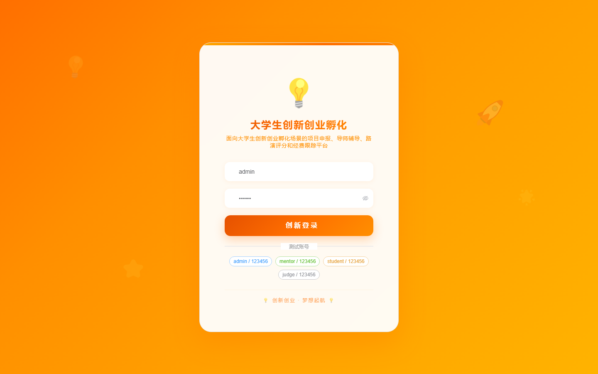

# 137 - 大学生创新创业项目孵化管理平台

## 项目信息

- 项目编号：`137`
- 组件类型：`backend, frontend`
- 后端入口：`http://127.0.0.1:8137`
- 前端入口：`http://127.0.0.1:3137`
- 账号来源：未识别
- 已收录截图：`17` 张

## 默认账号

- 暂未自动识别到默认账号

## 预览截图

### guest

#### guest-01-dashboard

#### guest-01-login

#### guest-02-register

#### guest-02-user

#### guest-03-project

#### guest-04-mentor

#### guest-05-team

#### guest-06-application

#### guest-07-plan

#### guest-08-coaching

#### guest-09-roadshow

#### guest-10-score

#### guest-11-funding

#### guest-12-milestone

#### guest-13-achievement

#### guest-14-notice

#### guest-15-log

