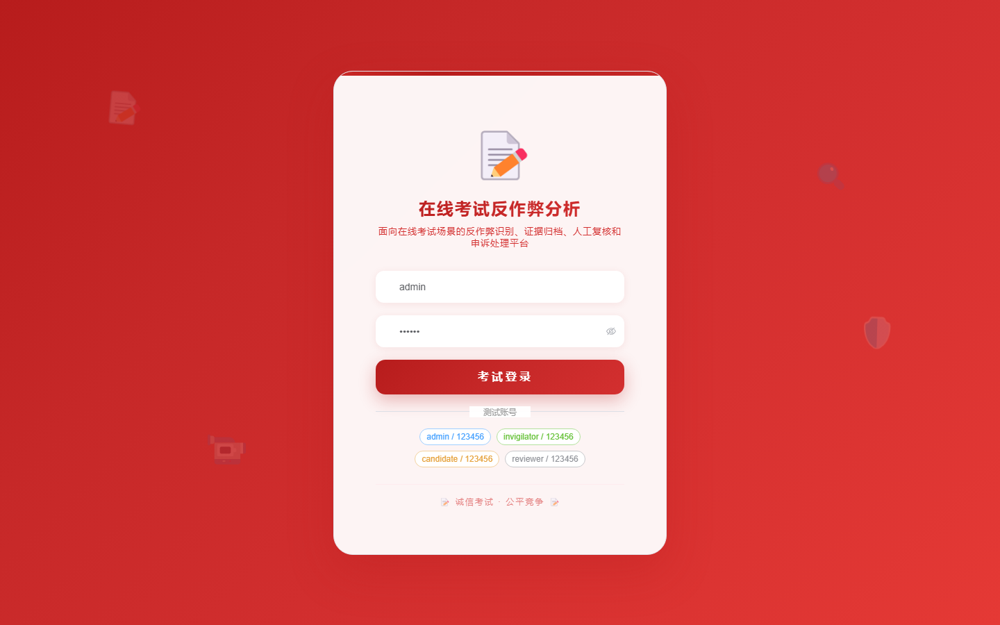
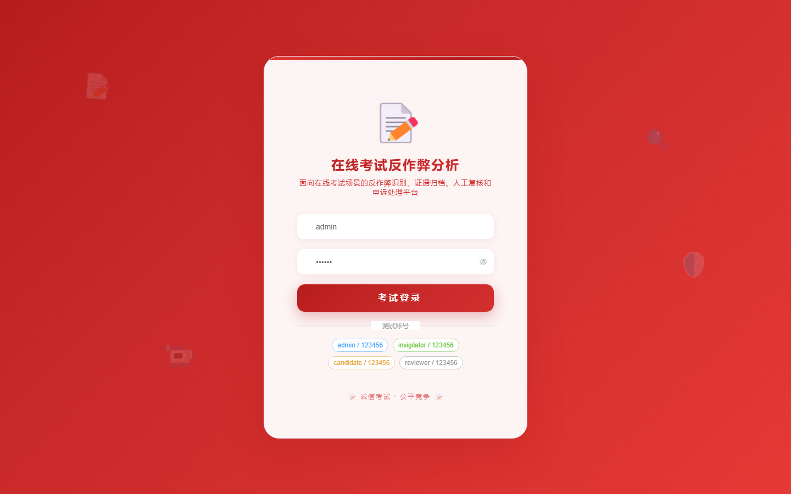
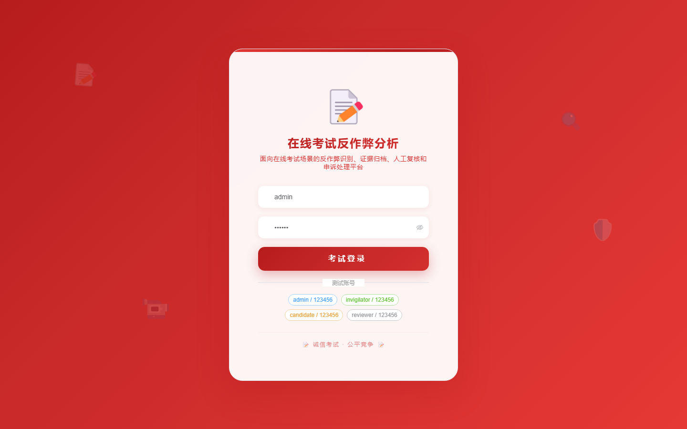

# 138 - 在线考试反作弊行为分析与证据管理系统

## 项目信息

- 项目编号：`138`
- 组件类型：`backend, frontend`
- 后端入口：`http://127.0.0.1:8138`
- 前端入口：`http://127.0.0.1:3138`
- 账号来源：未识别
- 已收录截图：`17` 张

## 默认账号

- 暂未自动识别到默认账号

## 预览截图

### guest

#### guest-01-dashboard

#### guest-01-login

#### guest-02-register

#### guest-02-user

#### guest-03-plan

#### guest-04-invigilator

#### guest-05-candidate

#### guest-06-session

#### guest-07-behavior

#### guest-08-evidence

#### guest-09-task

#### guest-10-decision

#### guest-11-rule

#### guest-12-device

#### guest-13-appeal

#### guest-14-notice

#### guest-15-log

