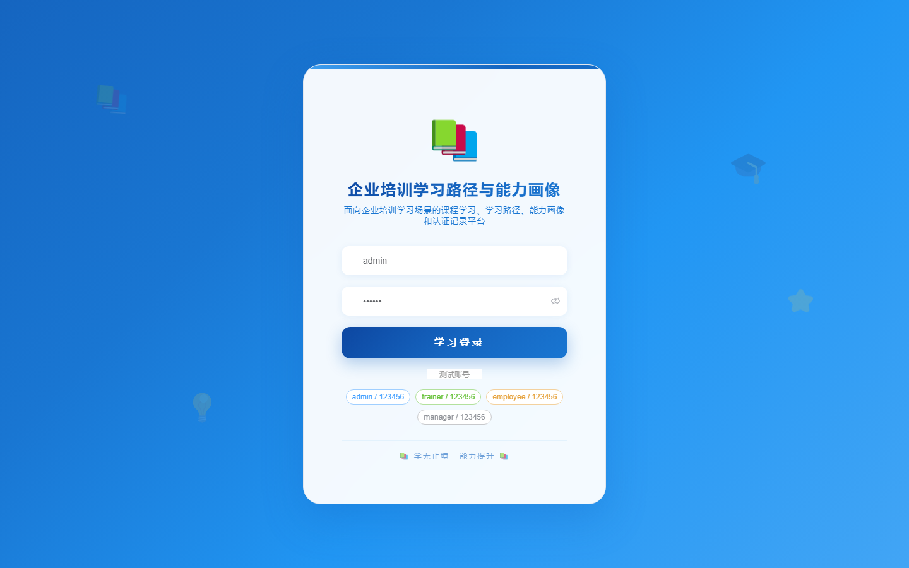
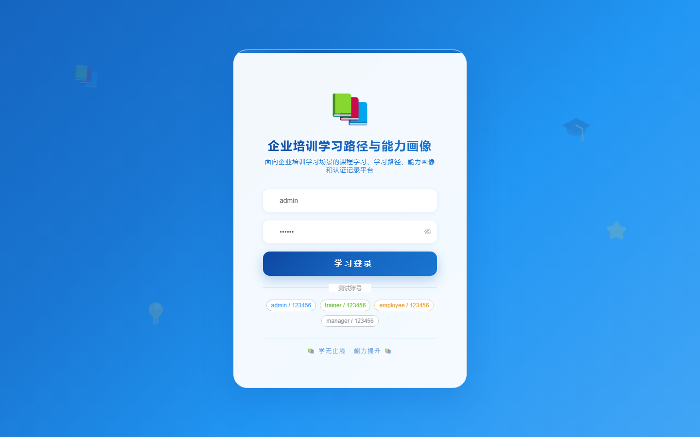
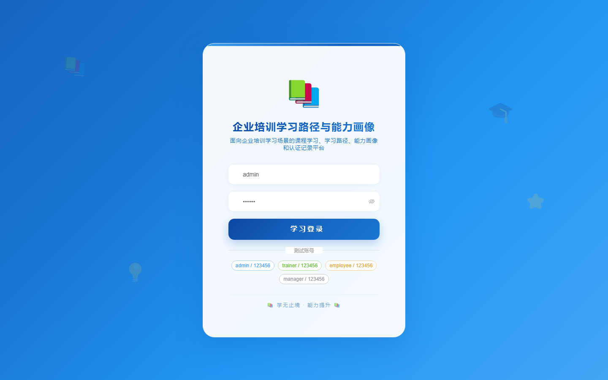
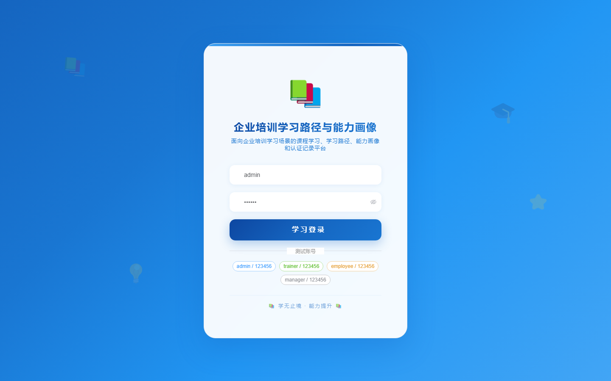

# 139 - 企业培训学习路径与能力画像系统

## 项目信息

- 项目编号：`139`
- 组件类型：`backend, frontend`
- 后端入口：`http://127.0.0.1:8139`
- 前端入口：`http://127.0.0.1:3139`
- 账号来源：未识别
- 已收录截图：`17` 张

## 默认账号

- 暂未自动识别到默认账号

## 预览截图

### guest

#### guest-01-dashboard

#### guest-01-login

#### guest-02-register

#### guest-02-user

#### guest-03-program

#### guest-04-course

#### guest-05-learner

#### guest-06-path

#### guest-07-task

#### guest-08-enroll

#### guest-09-exam

#### guest-10-score

#### guest-11-skill

#### guest-12-profile

#### guest-13-cert

#### guest-14-reminder

#### guest-15-log

