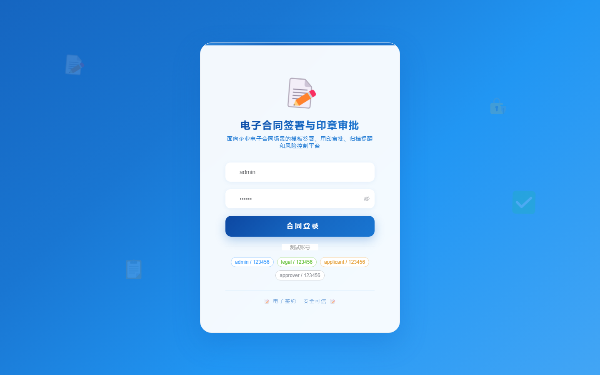
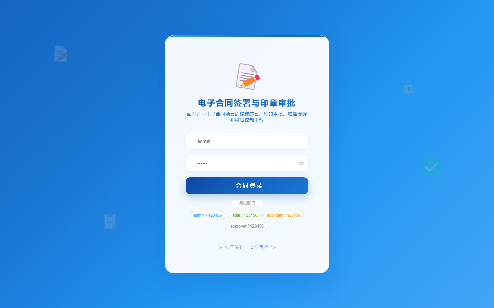
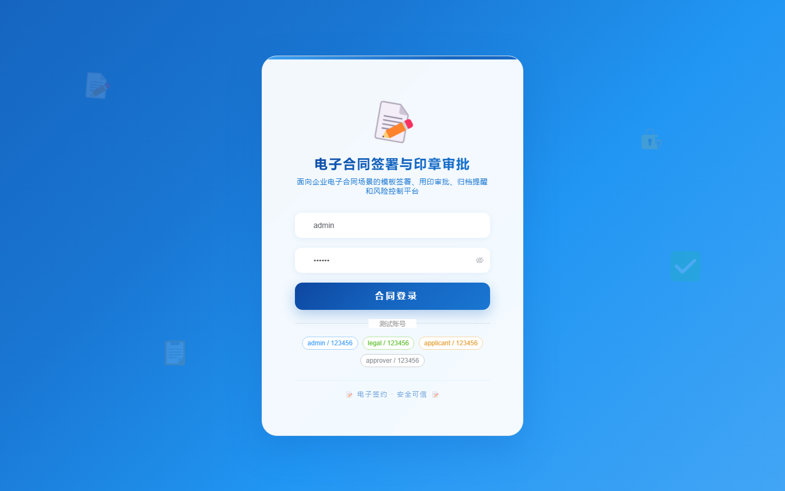
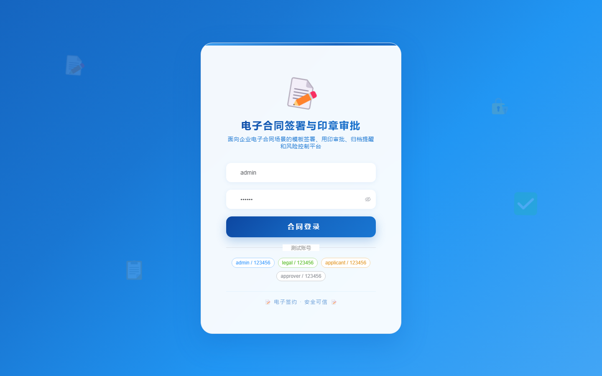

# 140 - 电子合同签署与印章审批管理系统

## 项目信息

- 项目编号：`140`
- 组件类型：`backend, frontend`
- 后端入口：`http://127.0.0.1:8140`
- 前端入口：`http://127.0.0.1:3140`
- 账号来源：未识别
- 已收录截图：`17` 张

## 默认账号

- 暂未自动识别到默认账号

## 预览截图

### guest

#### guest-01-dashboard

#### guest-01-login

#### guest-02-register

#### guest-02-user

#### guest-03-template

#### guest-04-counterparty

#### guest-05-signer

#### guest-06-draft

#### guest-07-seal-apply

#### guest-08-approval

#### guest-09-signing

#### guest-10-seal-record

#### guest-11-archive

#### guest-12-reminder

#### guest-13-risk

#### guest-14-notice

#### guest-15-log

