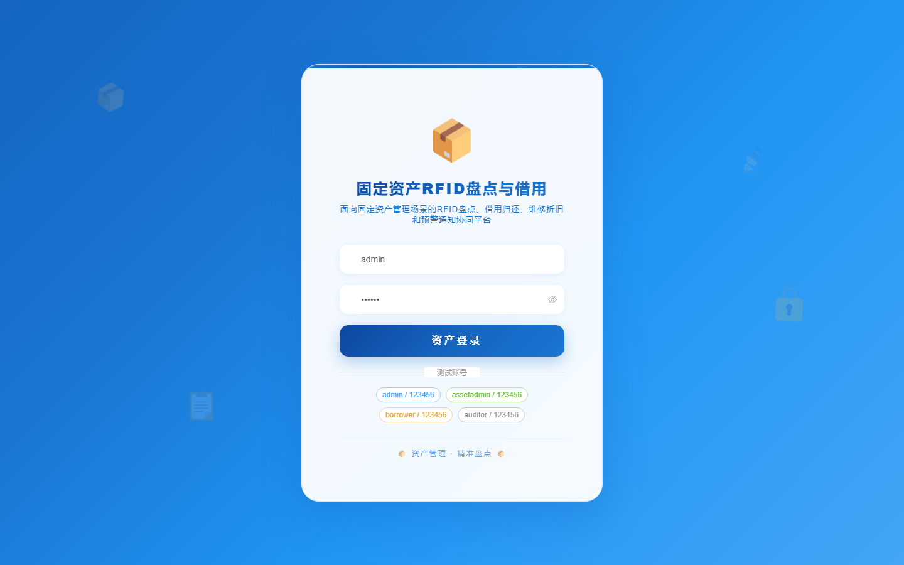
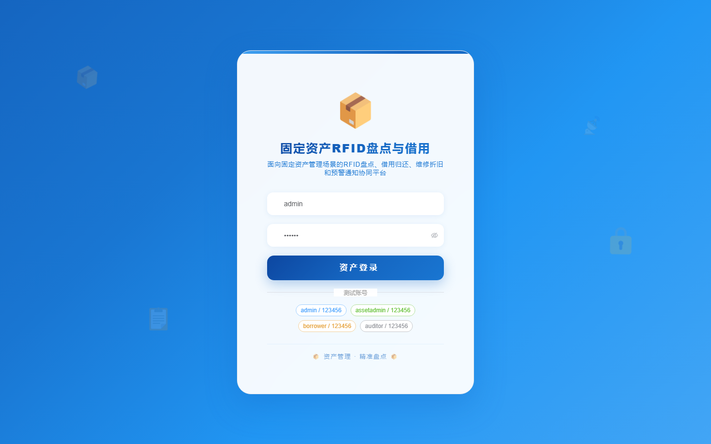

# 141 - 固定资产 RFID 盘点与借用归还系统

## 项目信息

- 项目编号：`141`
- 组件类型：`backend, frontend`
- 后端入口：`http://127.0.0.1:8141`
- 前端入口：`http://127.0.0.1:3141`
- 账号来源：未识别
- 已收录截图：`17` 张

## 默认账号

- 暂未自动识别到默认账号

## 预览截图

### guest

#### guest-01-dashboard

#### guest-01-login

#### guest-02-register

#### guest-02-user

#### guest-03-asset

#### guest-04-category

#### guest-05-tag

#### guest-06-location

#### guest-07-inventory-task

#### guest-08-inventory-record

#### guest-09-borrow-apply

#### guest-10-return-record

#### guest-11-repair

#### guest-12-depreciation

#### guest-13-disposal

#### guest-14-notice

#### guest-15-log

