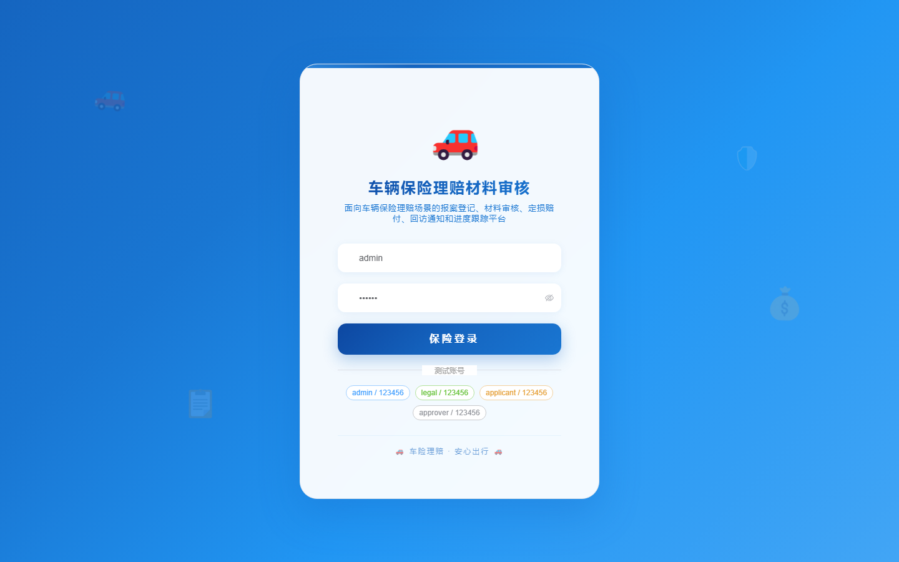
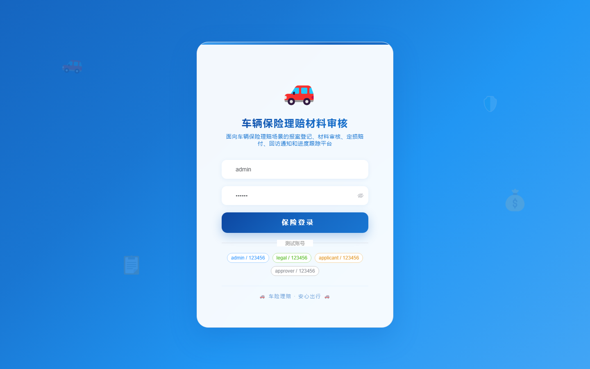

# 142 - 车辆保险理赔材料审核与进度跟踪系统

## 项目信息

- 项目编号：`142`
- 组件类型：`backend, frontend`
- 后端入口：`http://127.0.0.1:8142`
- 前端入口：`http://127.0.0.1:3142`
- 账号来源：未识别
- 已收录截图：`17` 张

## 默认账号

- 暂未自动识别到默认账号

## 预览截图

### guest

#### guest-01-dashboard

#### guest-01-login

#### guest-02-register

#### guest-02-user

#### guest-03-policy

#### guest-04-vehicle

#### guest-05-customer

#### guest-06-claim

#### guest-07-accident

#### guest-08-material

#### guest-09-review

#### guest-10-assessment

#### guest-11-compensation

#### guest-12-progress

#### guest-13-followup

#### guest-14-notice

#### guest-15-log

