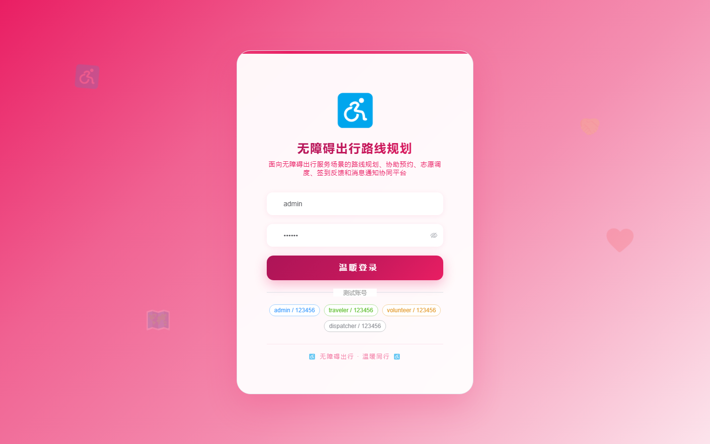
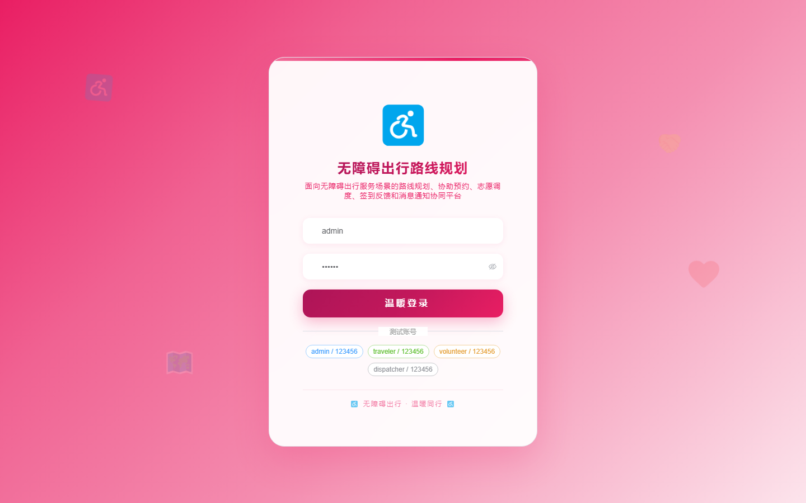

# 144 - 无障碍出行路线规划与志愿协助平台

## 项目信息

- 项目编号：`144`
- 组件类型：`backend, frontend`
- 后端入口：`http://127.0.0.1:8144`
- 前端入口：`http://127.0.0.1:3144`
- 账号来源：未识别
- 已收录截图：`17` 张

## 默认账号

- 暂未自动识别到默认账号

## 预览截图

### guest

#### guest-01-dashboard

#### guest-01-login

#### guest-02-register

#### guest-02-user

#### guest-03-route

#### guest-04-facility

#### guest-05-traveler

#### guest-06-request

#### guest-07-volunteer

#### guest-08-plan

#### guest-09-task

#### guest-10-checkin

#### guest-11-feedback

#### guest-12-contact

#### guest-13-trip

#### guest-14-notice

#### guest-15-log

