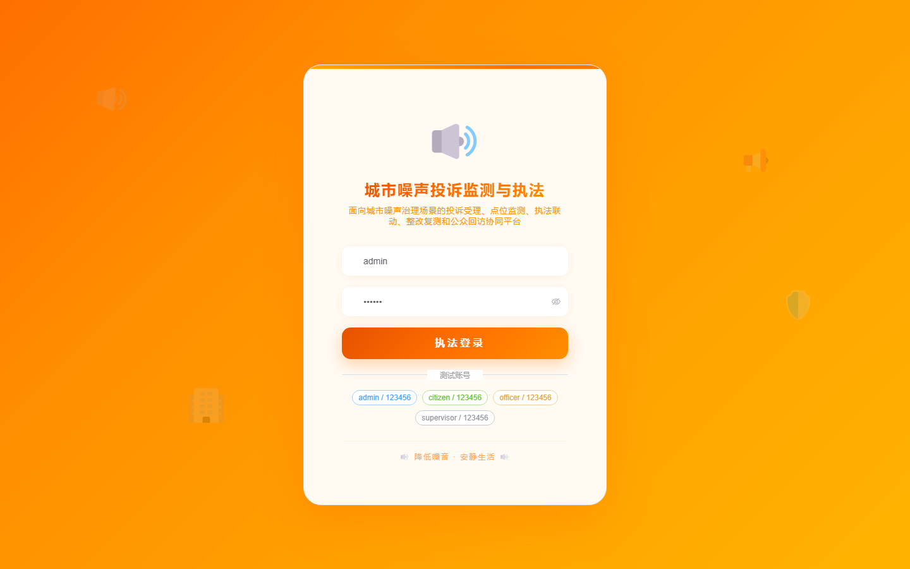

# 145 - 城市噪声投诉监测与执法协同平台

## 项目信息

- 项目编号：`145`
- 组件类型：`backend, frontend`
- 后端入口：`http://127.0.0.1:8145`
- 前端入口：`http://127.0.0.1:3145`
- 账号来源：未识别
- 已收录截图：`17` 张

## 默认账号

- 暂未自动识别到默认账号

## 预览截图

### guest

#### guest-01-dashboard

#### guest-01-login

#### guest-02-register

#### guest-02-user

#### guest-03-complaint

#### guest-04-site

#### guest-05-source

#### guest-06-officer

#### guest-07-task

#### guest-08-patrol

#### guest-09-rectify

#### guest-10-retest

#### guest-11-penalty

#### guest-12-feedback

#### guest-13-rule

#### guest-14-notice

#### guest-15-log

